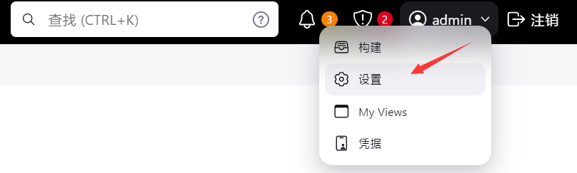

# jenkins版本和所需jdk版本的匹配图

https://www.jenkins.io/doc/book/platform-information/support-policy-java/


# 安装

## 安装JDK17

**创建安装目录**

```sh
mkdir -p /usr/local/java
```

**下载**

进入`/usr/local/java`

```sh
wget https://download.oracle.com/java/17/archive/jdk-17.0.12_linux-x64_bin.tar.gz
```

**解压**

```sh
tar -zxvf jdk-17.0.12_linux-x64_bin.tar.gz -C /usr/local/java/
```

**配置环境变量**

```sh
vim /etc/profile
```

添加以下内容

```sh
export JAVA_HOME=/usr/local/java/jdk-17.0.12
export PATH=$PATH:$JAVA_HOME/bin 
export CLASSPATH=.:$JAVA_HOME/lib/dt.jar:$JAVA_HOME/lib/tools.jar
```

生效变量

```sh
source /etc/profile
```

**验证**.

```sh
java -version
```


## 下载安装

**查看支持JDK17的版本**

 https://pkg.jenkins.io/redhat-stable/，

**搜索版本号**

 https://repo.huaweicloud.com/jenkins/redhat-stable/ 

**下载**

```sh
wget https://repo.huaweicloud.com/jenkins/redhat-stable/jenkins-2.452.4-1.1.noarch.rpm
```

**安装**

```sh
rpm -ivh jenkins-2.452.4-1.1.noarch.rpm
```

**配置 jenkins JDK路径**

```sh
vim /usr/lib/systemd/system/jenkins.service
```

`readlink -f $(which java)` 可以查找 `java` 命令的实际文件路径


~~修改 Jenkins 用户权限为 root~~，可做可不做，有问题就不做

```sh
vim /usr/lib/systemd/system/jenkins.service
```


**启动服务**

```sh
systemctl start jenkins.service 
```

**获取 Jenkins 默认登录密码**

```sh
cat /var/lib/jenkins/secrets/initialAdminPassword
```

**进入管理页面，填写密码**

ip:8080

**插件安装**


**不创建账户，默认使用admin登录**


**修改登录密码**




## 其他问题

### 启动报错

启动遇到以下报错，一般都是JDK版本不对，我就是装了JDK11不行，换了17才可以，还要去`/usr/lib/systemd/system/jenkins.service`配置 jenkins JDK路径

```
......
Oct 22 23:38:32 localhost.localdomain systemd[1]: start request repeated too quickly for jenkins.service
Oct 22 23:38:32 localhost.localdomain systemd[1]: Failed to start Jenkins Continuous Integration Server.
.....
```

### 卸载`rpm`方式安装的`jenkins`

1、卸载

```sh
rpm -e jenkins
```

2、检查是否卸载成功

```sh
rpm -ql jenkins 
```

3、彻底删除残留文件

```sh
find / -iname jenkins | xargs -n 1000 rm -rf
```

### 卸载通过 RPM安装的所有包含 "java" 的软件包

```sh
rpm -qa | grep java | xargs rpm -e --nodeps
```

