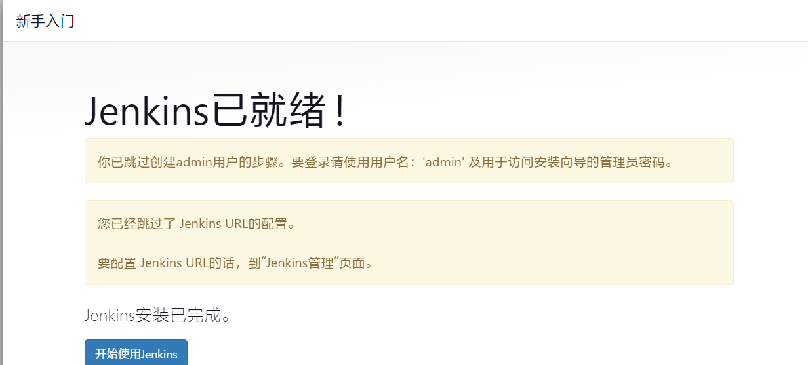

# jenkins版本和所需jdk版本的匹配图

https://www.jenkins.io/doc/book/platform-information/support-policy-java/


# 安装

## 安装JDK17

**创建安装目录**

```sh
mkdir -p /usr/local/java
```

**下载**

进入`/usr/local/java`

```sh
wget https://download.oracle.com/java/17/archive/jdk-17.0.12_linux-x64_bin.tar.gz
```

**解压**

```sh
tar -zxvf jdk-17.0.12_linux-x64_bin.tar.gz -C /usr/local/java/
```

**配置环境变量**

```sh
vim /etc/profile
```

添加以下内容

```sh
export JAVA_HOME=/usr/local/java/jdk-17.0.12
export PATH=$PATH:$JAVA_HOME/bin 
export CLASSPATH=.:$JAVA_HOME/lib/dt.jar:$JAVA_HOME/lib/tools.jar
```

生效变量

```sh
source /etc/profile
```

**验证**.

```sh
java -version
```


## 下载安装

**查看支持JDK17的版本**

 https://pkg.jenkins.io/redhat-stable/，

**搜索版本号**

 https://repo.huaweicloud.com/jenkins/redhat-stable/ 

**下载**

```sh
wget https://repo.huaweicloud.com/jenkins/redhat-stable/jenkins-2.452.4-1.1.noarch.rpm
```

**安装**

```sh
rpm -ivh jenkins-2.452.4-1.1.noarch.rpm
```

**配置 jenkins JDK路径**

```sh
vim /usr/lib/systemd/system/jenkins.service
```

`readlink -f $(which java)` 可以查找 `java` 命令的实际文件路径


~~修改 Jenkins 用户权限为 root~~，可做可不做，有问题就不做

```sh
vim /usr/lib/systemd/system/jenkins.service
```


**启动服务**

```sh
systemctl start jenkins.service 
```

**获取 Jenkins 默认登录密码**

```sh
cat /var/lib/jenkins/secrets/initialAdminPassword
```

**进入管理页面，填写密码**

ip:8080

**插件安装**


**不创建账户，默认使用admin登录**




**修改登录密码**


## 其他问题

### 启动报错

启动遇到以下报错，一般都是JDK版本不对，我就是装了JDK11不行，换了17才可以，还要去`/usr/lib/systemd/system/jenkins.service`配置 jenkins JDK路径

```
......
Oct 22 23:38:32 localhost.localdomain systemd[1]: start request repeated too quickly for jenkins.service
Oct 22 23:38:32 localhost.localdomain systemd[1]: Failed to start Jenkins Continuous Integration Server.
.....
```

### 卸载`rpm`方式安装的`jenkins`

1、卸载

```sh
rpm -e jenkins
```

2、检查是否卸载成功

```sh
rpm -ql jenkins 
```

3、彻底删除残留文件

```sh
find / -iname jenkins | xargs -n 1000 rm -rf
```

### 卸载通过 RPM安装的所有包含 "java" 的软件包

```sh
rpm -qa | grep java | xargs rpm -e --nodeps
```

# 简单自动部署java服务

## 安装maven

下载

```
wget https://archive.apache.org/dist/maven/maven-3/3.9.9/binaries/apache-maven-3.9.9-bin.tar.gz
```

配置环境变量

```
vim /etc/profile
```

添加下面这个

```
MAVEN_HOME=/root/apache-maven-3.9.9
export PATH=${MAVEN_HOME}/bin:${PATH}
```

重新加载环境变量

```
source /etc/profile
```

配置maven国内镜像和仓库地址，编辑 maven目录/conf/settings.xml

```xml
<localRepository>/root/apache-maven-3.9.9/repository</localRepository>

 <mirror>
	<id>alimaven</id>
	<mirrorOf>central</mirrorOf>
	<name>aliyun maven</name>
	<url>http://maven.aliyun.com/nexus/content/repositories/central/</url>
</mirror>
```

## jenkins 安装相关插件

### Maven Integration plugin

新建任务时没有maven选项，则需要安装这个


### Publish Over SSH

自动部署：用于通过 SSH 协议，将构建产物、脚本或文件传输到远程服务器，并可在传输完成后执行远程命令


## 配置凭据

配置需要部署的服务器账号密码，git仓库账号密码（如gitee）


## Publish over SSH-配置要部署的服务器信息

进入系统配置，新增一个SSH Servers进行配置


**name**: 给主机起一个名字

**Hostname**: 主机ip

**Username**: 主机账号

**Remote Directory**

1. 基础目录（Base Directory）：

   - `Remote Directory` 是此配置中所有操作的起始目录或根目录。
   - 文件的上传路径和后续命令的执行路径都相对于此目录。

   目录必须存在：

   - 插件本身不会自动创建这个目录，因此在使用前需要确保目标服务器上该目录已经存在。

   文件只能存放在此目录下：

   - 插件只能上传文件到此目录及其子目录，无法超出这个范围。
   - 这是一个限制，以避免插件意外地覆盖或影响不相关的文件。

   命令执行的权限不受限制：

   - 重要提示：虽然文件传输受限于 `Remote Directory`，但在该目录下执行的命令（如 `execCommand`）却没有这种限制。
   - 如果传输文件的用户有权限，这些命令可以在任何目录创建、删除或移动文件。


这些配完发现密码还没配呢，密码的配置在高级选项里

勾选使用账号密码进行身份验证，并设置密码，端口啥的也可以改默认22端口


## 全局工具配置

### maven配置

设置使用我们的setting文件


填写安装好的maven目录


### git

配置下，没有就百度linux安装git


### JDK

填写安装的JDK路径


## 上传代码到gitee

https://gitee.com/NewBornTechnology/jekins-deploy-test.git

一个简单的springboot项目，可以访问接口

## 项目创建

**构建一个maven项目**

比如创建一个任务名为maven_test的maven项目


**配置源码**


**构建环境**

选择Send files or execute commands over SSH after the build runs - 构建运行后通过 SSH 发送文件或执行命令

**Name**：选择之前配置的服务器

**Source files**：要上传到部署的服务器的文件，填写这个jekins项目路径的相对位置

这个任务在jenkins工作空间`/var/lib/jenkins/workspace/maven_test/`

jar包位置`/var/lib/jenkins/workspace/maven_test/target/jekins-deploy-test-0.0.1.jar`（拉取的代码在maven_test目录下，编译后的jar在target目录中）

那么填写`target/jekins-deploy-test-0.0.1.jar`

**Remove prefix**：移除jar包的前缀`target/`，不然传输到部署服务器的路径就会是`/root/root/target/jekins-deploy-test-0.0.1.jar`

**Remote directory**：传输到部署服务器的相对路径，绝对路径是Publish over SSH配置的Remote directory，所以最终这个jar路径是`/root/root/jekins-deploy-test-0.0.1.jar`,刚好配置的都是root目录名，这个目录不存在会创建


最后保存构建，就能运行jar了

```
[root@localhost ~]# ps -ef|grep jekins-deploy-test-0.0.1.jar
root       3285      1 22 00:48 ?        00:00:04 java -jar /var/lib/jenkins/workspace/maven_test/target/jekins-deploy-test-0.0.1.jar
```

访问下接口，成功


# 结合docker自动部署java服务

跟上面步骤一样，也是要创建maven项目，用于自动打包

不同的就是传输目录我变动了系哦啊，执行的命令使用写好的启动docker的脚本


提前在传输的目录写好启动脚本，Dockerfile，docker-compose.yml，用于启动Docker容器

**Dockerfile**

```dockerfile
from openjdk:8
# 当前目录下的jekins-deploy-test-0.0.1.jar 复制到容器的根目录
COPY ./jekins-deploy-test-0.0.1.jar /jekins-deploy-test-0.0.1.jar
# 定义容器启动时的命令，运行 JAR 文件
ENTRYPOINT ["java","-jar","/jekins-deploy-test-0.0.1.jar"]
```

**docker-compose.yml**

```yaml
services:
  jekins-deploy-test: #我们定义了一个名为 jekins-deploy-test 的服务，这个服务的相关配置会放在这个服务名称下面
    image: jekins-deploy-test:0.1 #Docker Compose 会使用这个指定的镜像来运行容器。如果镜像不存在，Docker Compose 会自动根据 build 配置尝试构建镜像。
    container_name: jekins-deploy-test #默认情况下，Docker 会为每个容器生成一个随机的名字，这样设置后，容器将会使用 jekins-deploy-test 作为容器名称，方便识别和管理。
    build: #如果你提供了 build 配置，Docker Compose 会根据指定的 Dockerfile 来构建镜像。通常用于开发时需要自定义镜像。
      dockerfile: Dockerfile #Docker Compose 会使用此文件作为构建镜像的蓝图。它会在当前目录查找 Dockerfile，如果文件名不同，可以在此处指定不同的文件名。
    ports:
      - "8666:8081"
```

**start.sh**

```sh
cd /root/docker
docker build -t jekins-deploy-test:0.1 .
docker-compose up -d
```


立即构建项目，等待执行完成

如果提示`ERROR: Exception when publishing, exception message [Exec exit status not zero. Status [126]]`

则表示要执行的脚本权限不足，执行下面命令即可

```sh
chmod +x /root/docker/start.sh
```

