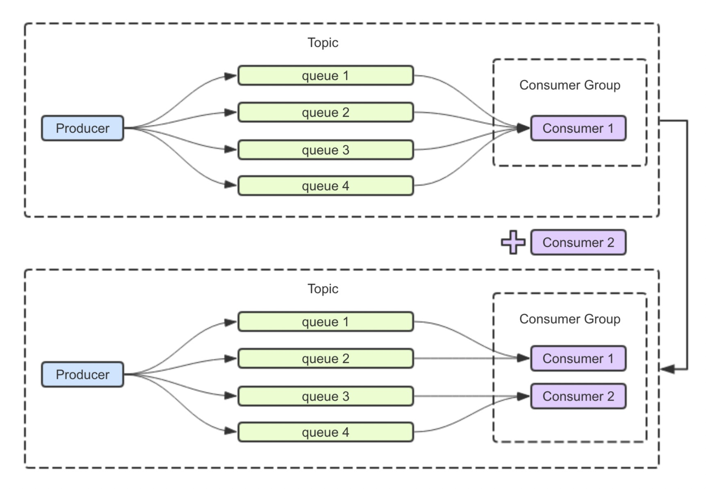

# RocketMQ5.2.0-linux 单机部署

## linux

要保证内存够，不然会杀进程，或者修改`runserver.sh`,`runbroker.sh`脚本把内存调小，这个试了感觉没啥效果

```shell
# 下载 RocketMQ 5.2.0 的二进制发行包
wget https://dist.apache.org/repos/dist/release/rocketmq/5.2.0/rocketmq-all-5.2.0-bin-release.zip

# 解压下载的压缩包
unzip rocketmq-all-5.2.0-bin-release.zip

# 进入解压后的 RocketMQ 目录中的 bin 子目录
cd rocketmq-all-5.2.0-bin-release/bin/

# 启动 RocketMQ Name Server，并将其放在后台运行
sh mqnamesrv &

# 启动 RocketMQ Broker，指定 Name Server 地址并启用代理功能，将其放在后台运行
sh mqbroker -n localhost:9876 --enable-proxy &

# 实时查看代理服务器日志，以便检查是否正常运行
tail -f ~/logs/rocketmqlogs/proxy.log
```

## windows

**下载并解压**

https://dist.apache.org/repos/dist/release/rocketmq/5.2.0/rocketmq-all-5.2.0-bin-release.zip

**启动mqnamesrv**

运行`bin\mqnamesrv.cmd`

**启动Broker**

进入 `bin` 目录,执行`start mqbroker.cmd -n localhost:9876`

# 概念

## 消费者分组

### 1. **负载均衡**

消费者分组实现了消息的负载均衡。当多个消费者实例属于同一个消费者分组时，RocketMQ 会将同一主题的消息分配给这些消费者实例进行消费。每条消息只会被同一消费者分组中的一个消费者实例消费，确保消息不会被重复消费。这有助于提高消费的并发能力和处理效率。

### 2. **消息广播**

消费者分组可以支持消息广播消费模式。在广播模式下，主题的每条消息会被消费者分组中的每个消费者实例消费一次。这样可以确保所有消费者实例都能接收到消息。这种模式适用于需要所有实例都处理消息的场景。

### 3. **消费状态管理**

消费者分组管理消费者的消费状态，包括消费进度（offset）和消费位置。当消费者实例重新启动或者新的消费者实例加入同一消费者分组时，它们可以继续从上次的位置开始消费，保证消息消费的连续性和可靠性。

### 4. **消息重试**

消费者分组支持消息重试机制。当消费者实例处理消息失败时，RocketMQ 可以将该消息重新投递到消费者分组，以便其他消费者实例或同一实例进行重试。这有助于保证消息的最终一致性和处理成功率。


假设你有3个消费者分组 A、B 和 C，并且它们都订阅了同一个主题 `topicX`，那么消息会被消费几次取决于消费模式：

- **集群模式**（默认模式）：
  - 如果所有分组 A、B 和 C 都使用集群模式，那么每个分组中的消费者实例都会消费到消息。
  - 每条消息会被每个分组各消费一次，总共会被消费3次。
- **广播模式**：
  - 如果所有分组 A、B 和 C 都使用广播模式，那么每个分组中的每个消费者实例都会消费到消息。
  - 每条消息会被每个分组的每个实例都消费一次。

## 队列的概念

- **Topic**：主题，是消息分类的标识。每个主题可以包含多个队列。
- **Queue**：队列，是消息实际存储的地方。每个主题下可以有多个队列，消息会分布在这些队列中。

## 消息发送与队列选择

在 RocketMQ 中，消息发送到主题时会通过特定的算法（如轮询、随机、顺序等）分配到该主题的不同队列中。以下是一些常见的队列选择策略：

- **轮询（Round Robin）**：消息按顺序循环发送到不同的队列。
- **随机（Random）**：消息随机分配到一个队列。
- **顺序（Orderly）**：如果启用了顺序消息（Orderly Message），消息会根据指定的键（如订单ID）发送到同一个队列，以确保同一键的消息按顺序消费。

# 顺序消息

RocketMQ 允许在同一个主题（Topic）下有多个队列。消息发送到同一主题时，默认情况下，消息会根据负载均衡策略分配到不同的队列。因此，同一主题下的消息并不一定会在同一个队列中，而是可能分散在多个队列中。

## 概念

顺序消息是一种特殊的消息类型，确保同一键的消息按顺序发送和消费。实现顺序消息的关键在于指定消息发送的 `hashKey`，RocketMQ 会根据这个 `hashKey` 将消息发送到同一个队列。例如，订单相关的消息可以使用订单ID作为 `hashKey`，这样订单的创建和支付消息会发送到同一个队列，确保顺序消费。

所以有的场景就是要按顺序一一消费，不然分布在不同队列就没办法按顺序消费了

## spring-boot整合rocketmq使用顺序消息

参考：https://blog.csdn.net/Alian_1223/article/details/136625959

使用的是RocketMQ 5.2.0

### 引入依赖

```xml
<?xml version="1.0" encoding="UTF-8"?>
<project xmlns="http://maven.apache.org/POM/4.0.0" xmlns:xsi="http://www.w3.org/2001/XMLSchema-instance"
         xsi:schemaLocation="http://maven.apache.org/POM/4.0.0 https://maven.apache.org/xsd/maven-4.0.0.xsd">
    <modelVersion>4.0.0</modelVersion>
    <parent>
        <groupId>com</groupId>
        <artifactId>rocketmq</artifactId>
        <version>1.0-SNAPSHOT</version>
    </parent>

    <artifactId>orderly_message</artifactId>
    <packaging>jar</packaging>

    <properties>
        <!--        加了下面这三个才不会启动报错找不到OrderlyMessageApplication-->
        <maven.compiler.source>8</maven.compiler.source>
        <maven.compiler.target>8</maven.compiler.target>
        <project.build.sourceEncoding>UTF-8</project.build.sourceEncoding>

        <spring-boot.version>2.7.6</spring-boot.version>
    </properties>
    <dependencies>
        <dependency>
            <groupId>org.springframework.boot</groupId>
            <artifactId>spring-boot-starter-web</artifactId>
        </dependency>
        <dependency>
            <groupId>org.apache.rocketmq</groupId>
            <artifactId>rocketmq-spring-boot-starter</artifactId>
            <version>2.3.0</version>
        </dependency>
    </dependencies>
    <dependencyManagement>
        <dependencies>
            <dependency>
                <groupId>org.springframework.boot</groupId>
                <artifactId>spring-boot-dependencies</artifactId>
                <version>${spring-boot.version}</version>
                <type>pom</type>
                <scope>import</scope>
            </dependency>
        </dependencies>
    </dependencyManagement>
</project>
```

### yml配置

```yaml
rocketmq:
  name-server: 127.0.1.1:9876  # RocketMQ 地址
  producer:
    group: orderlyProducerGroup  # 随便给一个默认的生产者组，不填启动项目报错 Field rocketMQTemplate in com.yhy.producer.SendOrderlyMessage required a bean of type 'org.apache.rocketmq.spring.core.RocketMQTemplate' that could not be found.
```

### 常量

```java
public interface Constant {
    String ORDERLY_CONSUMER_GROUP = "orderlyConsumerGroup";
    String ORDERLY_TOPIC = "orderlyTopic";
    String SYNC_ORDERLY_HASH_KEY = "syncOrderlyHashKey";
    String ASYNC_ORDERLY_HASH_KEY = "asyncOrderlyHashKey";
}
```

### 消费者

**consumeMode**这个是关键，保证这个主题是顺序消费

```java
@Slf4j
@Service
@RocketMQMessageListener(topic = Constant.ORDERLY_TOPIC,
        consumerGroup = Constant.ORDERLY_CONSUMER_GROUP,
        consumeMode = ConsumeMode.ORDERLY)
public class OrderMessageConsumer implements RocketMQListener<String> {

    @Override
    public void onMessage(String message) {
        log.info("订单消费者接收到的消息: {}", message);
        //延时5秒，看是否消费完成才继续消费下一个
        TimeUnit.SECONDS.sleep(5);
    }
}
```

### 生产者

有两个方法同步和异步，都只用同步，异步那个会出现消费不按照发送顺序

hashkey要一致，才能保证顺序

```java
@Slf4j
@Component
public class SendOrderlyMessage {

    @Autowired
    private RocketMQTemplate rocketMQTemplate;

    /**
     * 同步顺序消息
     */
    public void sync() {
        String message = "我是一条同步顺序消息:";
        for (int i = 1; i <= 5; i++) {
            // hashkey是为了确保这些消息被路由到同一个消息队列，这样消费者就能够按照顺序处理它们
            rocketMQTemplate.syncSendOrderly(Constant.ORDERLY_TOPIC, message + i, Constant.SYNC_ORDERLY_HASH_KEY);
        }
    }

    public void async() {
        String message = "我是一条异步顺序消息:";
        for (int i = 0; i < 5; i++) {
            // hashkey是为了确保这些消息被路由到同一个消息队列，这样消费者就能够按照顺序处理它们
            int finalI = i;
            rocketMQTemplate.asyncSendOrderly(Constant.ORDERLY_TOPIC, message + i, Constant.ASYNC_ORDERLY_HASH_KEY, new SendCallback() {
                @Override
                public void onSuccess(SendResult sendResult) {
                    // 异步发送成功的回调逻辑
                    log.info("异步顺序消息【{}】发送成功: {}", finalI, sendResult);
                }

                @Override
                public void onException(Throwable e) {
                    // 异步发送失败的回调逻辑
                    log.info("异步顺序消息【{}】发送失败: {}", finalI, e.getMessage());
                }
            });
//            try {
//                Thread.sleep(200L);
//            } catch (InterruptedException e) {
//                e.printStackTrace();
//            }
        }
    }
}
```

### 控制器

```java
@RestController
@RequestMapping
public class TestController {
    @Autowired
    private SendOrderlyMessage sendOrderlyMessage;

    @GetMapping("/sync")
    public void sync() {
        sendOrderlyMessage.sync();
    }

    @GetMapping("/async")
    public void async() {
        sendOrderlyMessage.async();
    }
}
```

### 测试

GET http://localhost:8080/sync，可以看出消费完一个才继续消费下一个

```
2024-06-11 09:56:00.145  INFO 9692 --- [ConsumerGroup_1] com.yhy.consumer.OrderMessageConsumer    : 订单消费者接收到的消息: 我是一条同步顺序消息:1
2024-06-11 09:56:05.148  INFO 9692 --- [ConsumerGroup_1] com.yhy.consumer.OrderMessageConsumer    : 订单消费者接收到的消息: 我是一条同步顺序消息:2
2024-06-11 09:56:10.148  INFO 9692 --- [ConsumerGroup_1] com.yhy.consumer.OrderMessageConsumer    : 订单消费者接收到的消息: 我是一条同步顺序消息:3
2024-06-11 09:56:15.148  INFO 9692 --- [ConsumerGroup_1] com.yhy.consumer.OrderMessageConsumer    : 订单消费者接收到的消息: 我是一条同步顺序消息:4
2024-06-11 09:56:20.149  INFO 9692 --- [ConsumerGroup_1] com.yhy.consumer.OrderMessageConsumer    : 订单消费者接收到的消息: 我是一条同步顺序消息:5

```

GET http://localhost:8080/async 可以看出消费不按照顺序，所以要使用syncSendOrderly同步方法

```
2024-06-07 16:15:41.488  INFO 15748 --- [blicExecutor_11] com.yhy.producer.SendOrderlyMessage      : 异步顺序消息【3】发送成功: SendResult [sendStatus=SEND_OK, msgId=C0A81F103D8418B4AAC222636D860008, offsetMsgId=AC10FC7500002A9F000000000000396C, messageQueue=MessageQueue [topic=orderlyTopic, brokerName=broker-a, queueId=2], queueOffset=27]
2024-06-07 16:15:41.488  INFO 15748 --- [blicExecutor_12] com.yhy.producer.SendOrderlyMessage      : 异步顺序消息【1】发送成功: SendResult [sendStatus=SEND_OK, msgId=C0A81F103D8418B4AAC222636D850006, offsetMsgId=AC10FC7500002A9F000000000000380E, messageQueue=MessageQueue [topic=orderlyTopic, brokerName=broker-a, queueId=2], queueOffset=26]
2024-06-07 16:15:41.488  INFO 15748 --- [blicExecutor_10] com.yhy.producer.SendOrderlyMessage      : 异步顺序消息【2】发送成功: SendResult [sendStatus=SEND_OK, msgId=C0A81F103D8418B4AAC222636D860007, offsetMsgId=AC10FC7500002A9F00000000000036B0, messageQueue=MessageQueue [topic=orderlyTopic, brokerName=broker-a, queueId=2], queueOffset=25]
2024-06-07 16:15:41.488  INFO 15748 --- [ublicExecutor_1] com.yhy.producer.SendOrderlyMessage      : 异步顺序消息【0】发送成功: SendResult [sendStatus=SEND_OK, msgId=C0A81F103D8418B4AAC222636D850005, offsetMsgId=AC10FC7500002A9F0000000000003ACA, messageQueue=MessageQueue [topic=orderlyTopic, brokerName=broker-a, queueId=2], queueOffset=28]
2024-06-07 16:15:41.492  INFO 15748 --- [ublicExecutor_2] com.yhy.producer.SendOrderlyMessage      : 异步顺序消息【4】发送成功: SendResult [sendStatus=SEND_OK, msgId=C0A81F103D8418B4AAC222636D860009, offsetMsgId=AC10FC7500002A9F0000000000003C28, messageQueue=MessageQueue [topic=orderlyTopic, brokerName=broker-a, queueId=2], queueOffset=29]
2024-06-07 16:15:41.492  INFO 15748 --- [ConsumerGroup_6] com.yhy.consume.OrderMessageConsumer     : 订单消费者接收到的消息: 我是一条异步顺序消息:2
2024-06-07 16:15:41.492  INFO 15748 --- [ConsumerGroup_6] com.yhy.consume.OrderMessageConsumer     : 订单消费者接收到的消息: 我是一条异步顺序消息:1
2024-06-07 16:15:41.518  INFO 15748 --- [ConsumerGroup_7] com.yhy.consume.OrderMessageConsumer     : 订单消费者接收到的消息: 我是一条异步顺序消息:3
2024-06-07 16:15:41.518  INFO 15748 --- [ConsumerGroup_7] com.yhy.consume.OrderMessageConsumer     : 订单消费者接收到的消息: 我是一条异步顺序消息:0
2024-06-07 16:15:41.519  INFO 15748 --- [ConsumerGroup_7] com.yhy.consume.OrderMessageConsumer     : 订单消费者接收到的消息: 我是一条异步顺序消息:4
```

# 分布式事务解决方案之可靠消息最终一致性

## 前提概要

RocketMQ事务消息方案也只能保证最终一致性，无法保证强一致性，也就是可能，消费者消费失败了，但是生产者的事务是无法回滚的

最终一致性意味着系统中的各个组件在一段时间内可能会出现数据不一致的情况，但最终会达到一致的状态，但他会有一些机制来保证消息最终被成功消费

1. **消息重试机制**：消息系统通常会具备消息重试机制，即当消费者消费失败时，消息会被重新投递给消费者。在一定的重试次数后，如果消息依然无法被消费成功，系统可能会将消息发送到死信队列，待后续处理。
2. **消息幂等性**：生产者和消费者的业务逻辑应该具备幂等性，即多次执行同一个操作，产生的效果应该是一致的。这样即使消息被重复消费，也不会对系统产生不一致的影响。
3. **补偿机制**：如果消费者失败导致了数据不一致或其他问题，系统可能需要一些补偿机制来修复这些问题。例如，可以通过定期的数据校验和修复任务来保证系统的数据一致性。

总之，在最终一致性的场景下，系统中可能会存在一段时间的数据不一致，但随着时间的推移，系统会自动或通过一些机制逐步达到一致的状态。因此，尽管消费者失败但生产者未能回滚的情况下可能会短暂出现数据不一致，但仍然可以认为系统满足最终一致性的要求。

## 本地消息表方案

1. 通过本地事务保证数据业务操作和消息的一致性
2. 然后定时任务将消息发送至消息中间件
3. 待确认消息发送给消费方成功再将消息删除

### 案例

注册送积分为例来说明：下例共有两个微服务交互，用户服务和积分服务，用户服务负责添加用户，积分服务负责增加积分。


交互流程如下：
**1、用户注册**
用户服务在本地事务新增用户和增加 ”积分消息日志“。（用户表和消息表通过本地事务保证一致）
下边是伪代码

```mysql
begin transaction；
//1.新增用户
//2.存储积分消息日志
commit transation;
```

这种情况下，本地数据库操作与存储积分消息日志处于同一个事务中，本地数据库操作与记录消息日志操作具备原
子性。

**2、定时任务扫描日志**
如何保证将消息发送给消息队列呢？
经过第一步消息已经写到消息日志表中，可以启动独立的线程，定时对消息日志表中的消息进行扫描并发送至消息
中间件，在消息中间件反馈发送成功后删除该消息日志，否则等待定时任务下一周期重试。

**3、消费消息**
如何保证消费者一定能消费到消息呢？
这里可以使用MQ的ack（即消息确认）机制，消费者监听MQ，如果消费者接收到消息并且业务处理完成后向MQ
发送ack（即消息确认），此时说明消费者正常消费消息完成，MQ将不再向消费者推送消息，否则消费者会不断重
试向消费者来发送消息。
积分服务接收到”增加积分“消息，开始增加积分，积分增加成功后向消息中间件回应ack，否则消息中间件将重复
投递此消息。
由于消息会重复投递，积分服务的”增加积分“功能需要实现幂等性。

## RocketMQ事务消息方案

在RocketMQ 4.3后实现了完整的事务消息，实际上其实是对本地消息表的一个封装，将本地消息表移动到了MQ
内部，解决 Producer 端的消息发送与本地事务执行的原子性问题。


### 名词解释

- **MQ发送方**就是用户服务

- **本地事务**就是执行新增用户操作

- **MQ订阅方**就是积分服务，监听发送方的消息，执行增加积分逻辑
- **半消息**是指在事务消息发送阶段发送的一种特殊类型的消息，它与普通消息不同之处在于，半消息在发送后处于不可消费状态，直到与本地事务执行结果相匹配后才能被消费。

### 执行顺序

1.**生产者发送事务消息**
Producer （MQ发送方）发送事务消息(半消息)至MQ Server，MQ Server将消息状态标记为Prepared（预备状态），注意此时这条消息消费者（MQ订阅方）是无法消费到的。 
本例中，Producer 发送 ”增加积分消息“ 到MQ Server。

2.**MQ Server回应消息发送成功**
MQ Server接收到Producer 发送给的消息则回应发送成功表示MQ已接收到消息。

3.**Producer 执行本地事务**
Producer 端执行本地事务,里面写了业务代码逻辑，通过本地数据库事务控制。
本例中，Producer 执行本地事务方法就是添加用户操作。

4.**消息投递**

- 若Producer **本地事务执行成功**则自动向MQServer发送**commit**消息，MQ Server接收到commit消息后将"增加积分消息" 状态标记为可消费，此时MQ订阅方（积分服务）即正常消费消息
- 若Producer **本地事务执行失败**则自动向MQServer发送**rollback**消息，MQ Server接收到rollback消息后将删除"增加积分消息"
- MQ订阅方（积分服务）消费消息，消费成功则向MQ回应ack，否则将重复接收消息。
- 这里ack默认自动回应，即程序执行正常则自动回应ack

5.**事务回查**
如果执行Producer端本地事务过程中，执行端**挂掉**，或者**超时**，MQ Server将会不停的询问同组的其他 Producer
来获取事务执行状态，这个过程叫**事务回查**。

MQ Server会根据事务回查结果来决定是否投递消息。

以上主干流程已由RocketMQ实现，对用户侧来说，用户需要分别实现本地事务执行以及本地事务回查方法，因此
只需关注本地事务的执行状态即可。

```java
public interface RocketMQLocalTransactionListener {
/**
‐ 发送半消息成功此方法被回调，该方法用于执行本地事务，即本地业务逻辑
‐ @param msg 回传的消息，利用transactionId即可获取到该消息的唯一Id
‐ @param arg 调用send方法时传递的参数，当send时候若有额外的参数可以传递到send方法中，这里能获取到
‐ @return 返回事务状态，COMMIT：提交 ROLLBACK：回滚 UNKNOW：回调
*/
RocketMQLocalTransactionState executeLocalTransaction(Message msg, Object arg);
/**
如果 RocketMQ 在一定时间内（例如超过了预设的事务消息过期时间）未收到executeLocalTransaction事务消息的提交或回滚确认，RocketMQ 就会认为该事务消息可能存在异常，进而触发消息回查机制

‐ @param msg 通过获取transactionId来判断这条消息的本地事务执行状态
‐ @return 返回事务状态，COMMIT：提交 ROLLBACK：回滚 UNKNOW：回调
*/
RocketMQLocalTransactionState checkLocalTransaction(Message msg);
}
```

**事务消息超过预设的过期时间**可能发生在以下情况下：

1. **本地事务执行时间过长**：生产者执行本地事务的时间超出了预期，导致事务消息在执行完本地事务后，提交或回滚确认的时间延迟。
2. **网络故障或消息延迟**：在消息传输过程中，由于网络故障或消息队列服务器负载较高等原因，导致事务消息的发送或确认过程出现延迟。
3. **生产者异常退出**：生产者在发送事务消息后发生异常退出，导致事务消息无法得到及时的提交或回滚确认，从而超过了预设的过期时间。
4. **生产者未能及时处理回查请求**：当 RocketMQ 执行事务消息回查时，生产者未能及时响应回查请求或处理回查请求失败，导致事务消息未能及时得到最终的提交或回滚确认。
5. **业务流程异常**：在复杂的业务场景中，可能存在各种意外情况或异常场景，导致事务消息未能按照预期的方式执行和确认，从而超过了预设的过期时间。

总之，事务消息超过预设的过期时间可能发生在生产者执行本地事务的时间过长、消息传输过程中出现延迟、生产者异常退出、回查请求未能及时处理等情况下。为了避免这种情况的发生，需要合理设置事务消息的过期时间，并确保在生产者端和消息队列服务器端的处理过程中保持高效和稳定。

### 总结执行顺序

1. 在生产者这边发送一条半消息（不可消费）

2. MQ回应发送成功，就去执行本地事务方法
3. 本地事务执行
   3.1. 本地事务执行成功（返回cmomit），就会让半消息标记为可消费，消费者那边执行完逻辑返回成功，则整个事务完成
   3.2. 本地事务执行失败，就回滚，消息肯定也消费不了
4. 本地事务方法超过预设时间没返回状态，调用事务回查方法看是否执行本地事务成功（通过幂等，就是消息表是否插入成功保证），然后进行提交或回滚

### 案例

#### 业务说明
本实例通过RocketMQ中间件实现可靠消息最终一致性分布式事务，模拟两个账户的转账交易过程

两个账户分别在不同的银行(张三在bank1、李四在bank2)，bank1、bank2是两个微服务和库

交易过程是，张三给李四转账指定金额。

上述交易步骤，张三扣减金额与给bank2发转账消息，两个操作必须是一个整体性的事务。


#### 程序组成部分

包括bank1和bank2两个数据库。

rocketmq 服务端：RocketMQ-4.5.0

**微服务及数据库的关系**

dtx/dtx-txmsg-demo/dtx-txmsg-demo-bank1 银行1，操作张三账户， 连接数据库bank1

dtx/dtx-txmsg-demo/dtx-txmsg-demo-bank2 银行2，操作李四账户，连接数据库bank2

**交互流程如下**
1、Bank1向MQ Server发送转账消息
2、Bank1执行本地事务，扣减金额
3、Bank2接收消息，执行本地事务，添加金额

#### 创建数据库

创建bank1库，并导入以下表结构和数据(包含张三账户)

```sql
CREATE DATABASE `bank1` CHARACTER SET 'utf8' COLLATE 'utf8_general_ci';
CREATE TABLE `account_info` (
`id` bigint(20) NOT NULL AUTO_INCREMENT,
`account_name` varchar(100) CHARACTER SET utf8 COLLATE utf8_bin NULL DEFAULT NULL COMMENT '户
主姓名',
`account_no` varchar(100) CHARACTER SET utf8 COLLATE utf8_bin NULL DEFAULT NULL COMMENT '银行
卡号',
`account_password` varchar(100) CHARACTER SET utf8 COLLATE utf8_bin NULL DEFAULT NULL COMMENT
'帐户密码',
`account_balance` double NULL DEFAULT NULL COMMENT '帐户余额',
PRIMARY KEY (`id`) USING BTREE
) ENGINE = InnoDB AUTO_INCREMENT = 5 CHARACTER SET = utf8 COLLATE = utf8_bin ROW_FORMAT =
Dynamic;
INSERT INTO `account_info` VALUES (2, '张三的账户', '1', '', 10);
#交易记录表(去重表)，用于交易幂等控制。
CREATE TABLE `de_duplication` (
`tx_no` varchar(64) COLLATE utf8_bin NOT NULL,
`create_time` datetime(0) NULL DEFAULT NULL,
PRIMARY KEY (`tx_no`) USING BTREE
) ENGINE = InnoDB CHARACTER SET = utf8 COLLATE = utf8_bin ROW_FORMAT = Dynamic;
```

创建bank2库，并导入以下表结构和数据(包含李四账户)

```sql
CREATE DATABASE `bank2` CHARACTER SET 'utf8' COLLATE 'utf8_general_ci';
CREATE TABLE `account_info` (
`id` bigint(20) NOT NULL AUTO_INCREMENT,
`account_name` varchar(100) CHARACTER SET utf8 COLLATE utf8_bin NULL DEFAULT NULL COMMENT '户
主姓名',
`account_no` varchar(100) CHARACTER SET utf8 COLLATE utf8_bin NULL DEFAULT NULL COMMENT '银行
卡号',
`account_password` varchar(100) CHARACTER SET utf8 COLLATE utf8_bin NULL DEFAULT NULL COMMENT
'帐户密码',
`account_balance` double NULL DEFAULT NULL COMMENT '帐户余额',
PRIMARY KEY (`id`) USING BTREE
) ENGINE = InnoDB AUTO_INCREMENT = 5 CHARACTER SET = utf8 COLLATE = utf8_bin ROW_FORMAT =
Dynamic;
INSERT INTO `account_info` VALUES (3, '李四的账户', '2', NULL, 0);
#交易记录表(去重表)，用于交易幂等控制。
CREATE TABLE `de_duplication` (
`tx_no` varchar(64) COLLATE utf8_bin NOT NULL,
`create_time` datetime(0) NULL DEFAULT NULL,
PRIMARY KEY (`tx_no`) USING BTREE
) ENGINE = InnoDB CHARACTER SET = utf8 COLLATE = utf8_bin ROW_FORMAT = Dynamic;
```

#### 启动RocketMQ
1.**下载RocketMQ服务器**
下载地址：https://rocketmq.apache.org/download/ 下4.5.0

**2.解压并启动**

启动nameserver

> 设置环境变量，windows直接去电脑右键属性设置
>
> ROCKETMQ_HOME=[rocketmq服务端解压路径]
>
> 进入bin目录双击`mqnamesrv.cmd`

启动broker

在bin目录下执行

> start mqbroker.cmd ‐n 127.0.0.1:9876 autoCreateTopicEnable=true

代码在https://github.com/Aerozb/learn-project/tree/main/rocketmq/transactional_message

#### bank1服务编写

**实现功能**

1. 张三扣减金额，提交本地事务
2. 向MQ发送转账消息

数据库操作：更新金额，添加事务id数据等

```java
@Mapper
public interface AccountInfoDao {
    
    @Update("update account_info set account_balance=account_balance+#{amount} where account_no=#{accountNo}")
    int updateAccountBalance(@Param("accountNo") String accountNo, @Param("amount") Double amount);

    @Select("select count(1) from de_duplication where tx_no = #{txNo}")
    int isExistTx(String txNo);

    @Insert("insert into de_duplication values(#{txNo},now());")
    int addTx(String txNo);

}
```

service：发送转账消息具体实现和更新账户扣减金额

```java
@Service
@Slf4j
public class AccountInfoServiceImpl implements AccountInfoService {

    @Autowired
    AccountInfoDao accountInfoDao;

    @Autowired
    RocketMQTemplate rocketMQTemplate;

    /**
     * 向mq发送转账消息
     */
    @Override
    public void sendUpdateAccountBalance(AccountChangeEvent accountChangeEvent) {
        //将accountChangeEvent转成json
        JSONObject jsonObject = new JSONObject();
        jsonObject.put("accountChange", accountChangeEvent);
        String jsonString = jsonObject.toJSONString();
        //生成message类型
        Message<String> message = MessageBuilder.withPayload(jsonString).build();
        /*
          发送一条事务消息
          String txProducerGroup 生产组
          String destination topic，
          Message<?> message, 消息内容
          Object arg 参数
         */
        rocketMQTemplate.sendMessageInTransaction("producer_group_txmsg_bank1", "topic_txmsg", message, null);
    }

    /**
     * 更新账户，扣减金额
     */
    @Override
    @Transactional
    public void doUpdateAccountBalance(AccountChangeEvent accountChangeEvent) {
        log.info("doUpdateAccountBalance,更新账户，扣减金额");
        //幂等判断
        if (accountInfoDao.isExistTx(accountChangeEvent.getTxNo()) > 0) {
            return;
        }
        //扣减金额
        accountInfoDao.updateAccountBalance(accountChangeEvent.getAccountNo(), accountChangeEvent.getAmount() * -1);
        //添加事务日志
        accountInfoDao.addTx(accountChangeEvent.getTxNo());
        log.info("doUpdateAccountBalance,txNo:{}",accountChangeEvent.getTxNo());
        if (accountChangeEvent.getAmount() == 3) {
            throw new RuntimeException("人为制造异常");
        }
    }
}
```

实现RocketMQLocalTransactionListener

```java
@Component
@Slf4j
@RocketMQTransactionListener(txProducerGroup = "producer_group_txmsg_bank1")
public class ProducerTxmsgListener implements RocketMQLocalTransactionListener {

    @Autowired
    AccountInfoService accountInfoService;

    @Autowired
    AccountInfoDao accountInfoDao;

    //事务消息发送后的回调方法，当消息发送给mq成功，此方法被回调，但是消息还处于未消费状态
    @Override
    @Transactional
    public RocketMQLocalTransactionState executeLocalTransaction(Message message, Object o) {
        log.info("executeLocalTransaction");
        try {
            //解析message，转成AccountChangeEvent
            String messageString = new String((byte[]) message.getPayload());
            JSONObject jsonObject = JSONObject.parseObject(messageString);
            String accountChangeString = jsonObject.getString("accountChange");
            //将accountChange（json）转成AccountChangeEvent
            AccountChangeEvent accountChangeEvent = JSONObject.parseObject(accountChangeString, AccountChangeEvent.class);
            //执行本地事务，扣减金额
            accountInfoService.doUpdateAccountBalance(accountChangeEvent);
            //当返回RocketMQLocalTransactionState.COMMIT，自动向mq发送commit消息，mq将消息的状态改为可消费
            return RocketMQLocalTransactionState.COMMIT;
        } catch (Exception e) {
            e.printStackTrace();
            return RocketMQLocalTransactionState.ROLLBACK;
        }
    }

    //事务状态回查，查询是否扣减金额
    @Override
    public RocketMQLocalTransactionState checkLocalTransaction(Message message) {
        //解析message，转成AccountChangeEvent
        String messageString = new String((byte[]) message.getPayload());
        JSONObject jsonObject = JSONObject.parseObject(messageString);
        String accountChangeString = jsonObject.getString("accountChange");
        //将accountChange（json）转成AccountChangeEvent
        AccountChangeEvent accountChangeEvent = JSON.parseObject(accountChangeString, AccountChangeEvent.class);
        //事务id
        String txNo = accountChangeEvent.getTxNo();
        log.info("checkLocalTransaction,txNo:{}",txNo);
        int existTx = accountInfoDao.isExistTx(txNo);
        if (existTx > 0) {
            return RocketMQLocalTransactionState.COMMIT;
        } else {
            return RocketMQLocalTransactionState.UNKNOWN;
        }
    }
}
```

发送一个转账消息

```java
@RestController
@Slf4j
public class AccountInfoController {
    @Autowired
    private AccountInfoService accountInfoService;

    @GetMapping(value = "/transfer")
    public String transfer(@RequestParam("accountNo") String accountNo, @RequestParam("amount") Double amount) {
        //创建一个事务id，作为消息内容发到mq
        String tx_no = UUID.randomUUID().toString();
        log.info("transfer,tx_no:{}",tx_no);
        AccountChangeEvent accountChangeEvent = new AccountChangeEvent(accountNo, amount, tx_no);
        //发送消息
        accountInfoService.sendUpdateAccountBalance(accountChangeEvent);
        return "转账成功";
    }
}
```

#### bank2服务编写

**实现功能**

1. 监听MQ，接收消息
2. 接收到消息增加账户金额

service：增加金额

```java
@Service
@Slf4j
public class AccountInfoServiceImpl implements AccountInfoService {

    @Autowired
    AccountInfoDao accountInfoDao;

    //更新账户，增加金额
    @Override
    @Transactional
    public void addAccountInfoBalance(AccountChangeEvent accountChangeEvent) {
        log.info("bank2更新本地账号，账号：{},金额：{}", accountChangeEvent.getAccountNo(), accountChangeEvent.getAmount());
        if (accountInfoDao.isExistTx(accountChangeEvent.getTxNo()) > 0) {
            return;
        }
        //增加金额
        accountInfoDao.updateAccountBalance(accountChangeEvent.getAccountNo(), accountChangeEvent.getAmount());
        //添加事务记录，用于幂等
        accountInfoDao.addTx(accountChangeEvent.getTxNo());
        if (accountChangeEvent.getAmount() == 4) {
            throw new RuntimeException("人为制造异常");
        }
    }
}
```

bank1的RocketMQLocalTransactionListener实现类返回commit，表示他那边本地事务执行成功，则这边开始消费，增加金额

```java
@Component
@Slf4j
@RocketMQMessageListener(consumerGroup = "consumer_group_txmsg_bank2",topic = "topic_txmsg")
public class TxmsgConsumer implements RocketMQListener<String> {

    @Autowired
    AccountInfoService accountInfoService;

    //接收消息
    @Override
    public void onMessage(String message) {
        log.info("开始消费消息:{}",message);
        //解析消息
        JSONObject jsonObject = JSONObject.parseObject(message);
        String accountChangeString = jsonObject.getString("accountChange");
        //转成AccountChangeEvent
        AccountChangeEvent accountChangeEvent = JSONObject.parseObject(accountChangeString, AccountChangeEvent.class);
        //设置账号为李四的
        accountChangeEvent.setAccountNo("2");
        //更新本地账户，增加金额
        accountInfoService.addAccountInfoBalance(accountChangeEvent);

    }
}
```


调用http://localhost:56081/transfer，参数自己传，结果如下

正常转账，张三初始金额是10，李四初始金额0，转账后张三-1,李四+1，一个9一个1，正常


# Spring使用RocketMQ，使用广播模式让每个消费者都能消费到

## 消息模型对比

| **特性**         | **广播模式 (BROADCASTING)**                        | **集群模式 (CLUSTERING)**                            |
| ---------------- | -------------------------------------------------- | ---------------------------------------------------- |
| **消息分发方式** | 所有消费者都会接收到消息                           | 每条消息只会被同一个消费者组中的一个消费者消费       |
| **消费并发性**   | 无并发控制，每个消费者独立接收消息                 | 并行消费，多个消费者共同处理消息                     |
| **负载均衡**     | 无负载均衡，所有消费者都接收消息                   | 消息在消费者组内均衡分配，负载均衡                   |
| **场景**         | 需要所有消费者接收到相同消息的场景，如通知、日志等 | 需要并行消费、任务分配的场景，如日志处理、任务调度等 |
| **适用情况**     | 短时间内需要广播通知给所有消费者                   | 高并发消息消费，需要多个消费者分担负载               |

## 使用

这样所有服务都会消费，每个服务的WhatsappSDK客户端都会被重置

```java
package org.apache.rocketmq.spring.annotation;

public enum MessageModel {
    BROADCASTING("BROADCASTING"),
    CLUSTERING("CLUSTERING");

    private final String modeCN;
}
```

```java
@Component
@RocketMQMessageListener(
        topic = CommonConstant.WHATSAPP_RESET_API_CLIENT_TOPIC,
        consumerGroup = CommonConstant.WHATSAPP_RESET_API_CLIENT_GROUP,
        messageModel = MessageModel.BROADCASTING // 设置为广播模式
)
@Slf4j
public class WhatsappResetApiClientConsumerListener implements RocketMQListener<String> {
    @Override
    public void onMessage(String accountId) {
        log.info("whatsapp,重置SDK客户端,消息开始消费,accountId:{}", accountId);
        WhatsappUtil.resetApiClient(accountId);
    }
}
```

# DefaultMQPushConsumer介绍

 RocketMQ 客户端中的一个消费端实现，它实现了消息的推送消费模式，即消费者不需要主动拉取消息，而是由RocketMQ服务器将消息推送给消费者

## 消费者不是拉代码嘛，为啥类名带Push 

### 消费模型：Pull 和 Push

1. **Pull Model（拉模式）**：
   - 在拉模式下，消费者主动从消息队列中拉取消息。消费者定期检查队列，判断是否有新消息。如果有，就拉取并处理。
   - 这种模式下，消费者控制拉取消息的频率和方式，通常会有较高的延迟，但也能有效避免消费者过载。
2. **Push Model（推模式）**：
   - 在推模式下，消费者并不主动拉取消息，而是消息队列自动将消息推送给消费者。消费者在接收到消息后进行处理。
   - 推模式下，消费者通常可以在收到消息后立即处理，延迟较低，但是需要消费者有能力处理大量并发的消息。

### 为什么 `DefaultMQPushConsumer` 叫“Push”？

尽管消费者是通过 RocketMQ 客户端去拉取消息，但 RocketMQ 采用的是 **推模式**的消息消费。其背后的实现是，RocketMQ Broker 将消息推送到消费者的线程池中，然后消费者从线程池中获取任务并处理。

具体来说，`DefaultMQPushConsumer` 采用的是 **推模式**，即：

- **消费者** 一开始就与 RocketMQ Broker 建立连接，保持连接状态。
- 当 Broker 有消息可供消费时，它会主动**推送**消息到消费者，消费者接收到消息后就开始处理。

消费者不是在没有消息时不断地发起拉取请求，而是在收到推送的消息后再进行处理，这就是“推模式”的由来。

### 总结

`DefaultMQPushConsumer` 中的 "Push" 其实表示的是消费者以“推模式”消费消息，虽然消费者依然是从队列中拉取消息，但在实现层面是通过推送消息的方式来管理消息消费的。因此，消费者处理消息的过程是**由服务器推送消息给消费者**来触发的。

# RocketMQ 使用的是哪种方式（Push 或 Pull）

## Push 模式（默认）

- 使用 `DefaultMQPushConsumer` 或 `@RocketMQMessageListener` 注解。
- 消息由 Broker 自动推送到消费者，消费者无需主动拉取。

## Pull 模式

- 使用 `DefaultMQPullConsumer` 来手动拉取消息。
- 消费者主动请求 Broker 拉取消息并进行处理。

## Push 模式实现

在 **Push 模式** 下，RocketMQ Broker 会主动通过长连接推送消息给消费者。这种方式能够确保消息的快速到达，并且具有较低的延迟。

Broker 和消费者之间的通信是通过 **Netty** 实现的，消费者注册订阅后，Broker 会在消息到达时自动推送给消费者。

## Pull 模式实现

```java
DefaultMQPullConsumer consumer = new DefaultMQPullConsumer("consumerGroup");
consumer.setNamesrvAddr("localhost:9876");
consumer.start();  // 启动消费者

while (true) {
    // 拉取消息
    PullResult pullResult = consumer.pullBlockIfNotFound(new MessageQueue("TestTopic", "localhost", 0), "*", 0, 32);
    // 处理消息
    System.out.println(pullResult.getMsgList());
}
```

# 消费者是否只会绑定某个队列，还是会消费该主题的其他队列

## 默认队列数

在 **RocketMQ** 中，主题（**Topic**）的默认队列数通常是 **4 个**

## syncSendOrderly(通过hashkey来实现顺序消费，保证每次都在同一队列)

**`syncSendOrderly`** 方法通过 `hashKey` 来指定消息应该发送到哪个队列，从而确保相同 `hashKey` 的消息总是发送到同一个队列，这样保证了顺序消费

```java
org.apache.rocketmq.spring.core.RocketMQTemplate#syncSendOrderly(topic, payload, hashKey)
```

- `hashKey`: 用于确保消息有序性的一种方法。通过 `hashKey` 来选择消息应该发送到哪个队列（Queue）。通常这个 `hashKey` 是一个能够代表业务顺序的字段，例如 `orderId`、`productId` 等。当多个消息有相同的 `hashKey` 时，它们会被发送到同一个队列，保证它们在这个队列中的顺序。

## 总结

**顺序消费（`ConsumeMode.ORDERLY`）**：每同一消费者实例只会从它分配的队列中按顺序消费消息，**绑定不会变的**；

**并发消费（`ConsumeMode.CONCURRENTLY`）**：每消费者可以从不同的队列中并行消费消息，**绑定是会变的**

**集群消费模式（MessageModel.CLUSTERING）**：每个消息队列只能由一个消费者实例消费。不同的消费者实例可以消费 **不同的队列**，确保负载均衡。

**广播消费模式（org.apache.rocketmq.spring.annotation.MessageModel#BROADCASTING）**：所有消费者都消费相同的消息，不会有消费者实例绑定到某个特定队列。

# 集群模式下，队列分配给哪个消费者

## 4.X版本-队列粒度负载均衡

> 同一消费者分组内的多个消费者将按照队列粒度消费消息，即每个队列仅被一个消费者消费




1. 如图一二，本来有4个队列，随着消费者增加就平均分配给每个消费者;

2. 当总队列数小于消费者的数量时，消费者将分配不到队列，即使消费者再多也无法提升消费能力

默认的分配策略是平均分配

```java
public DefaultMQPushConsumer() {
        this(MixAll.DEFAULT_CONSUMER_GROUP, null, new AllocateMessageQueueAveragely());
    }
```

## 5.X版本-消息粒度负载均衡

> 消息粒度负载均衡是在 **队列粒度负载均衡** 的基础上，进一步 **对消息的消费进行细粒度控制**。不同于传统的队列粒度，它允许 **一个队列中的消息** 根据 **不同消费者的消费进度**， **动态地分配给不同消费者**。
>
> 换句话说，消息粒度负载均衡的目标是 **基于消费进度** 来实现消息的动态分配，让每条消息都能够被分配到合适的消费者进行消费。

**举个例子**：

- 依然假设 Topic A 有 4 个队列（Queue0、Queue1、Queue2、Queue3）。
- 消费者组 `GroupA` 有 3 个消费者（C1、C2、C3）。
- C1 会首先消费 `Queue0` 中的消息，C2 会消费 `Queue1` 中的消息，C3 会消费 `Queue2` 中的消息。
- **如果某个消费者（比如 C1）由于消费卡住或处理缓慢导致其 Offset 没有更新，Broker 会将 C1 尚未消费的消息重新分配给其他消费者进行处理**，这就体现了消息粒度的负载均衡。

**优点**

相对于队列粒度负载均衡策略，消息粒度负载均衡策略有以下特点：

- 消费分摊更均衡：对于传统队列级的负载均衡策略，如果队列数量和消费者数量不均衡，则可能会出现部分消费者空闲，或部分消费者处理过多消息的情况。消息粒度负载均衡策略无需关注消费者和队列的相对数量，能够更均匀地分摊消息。
- 对非对等消费者更友好：在线上生产环境中，由于网络机房分区延迟、消费者物理资源规格不一致等原因，消费者的处理能力可能会不一致，如果按照队列分配消息，则可能出现部分消费者消息堆积、部分消费者空闲的情况。消息粒度负载均衡策略按需分配，消费者处理任务更均衡。
- 队列分配运维更方便：传统基于绑定队列的负载均衡策略必须保证队列数量大于等于消费者数量，以免产生部分消费者获取不到队列出现空转的情况，而消息粒度负载均衡策略则无需关注队列数。

## 区别

这两种方式都是某个队列分配给某个消费者

**队列粒度负载均衡** 是按照队列进行分配，消费者只能消费特定队列中的所有消息。

**消息粒度负载均衡** 是基于每条消息的消费进度，消费者可以消费队列中的不同消息，未消费的消息会被动态分配给其他消费者。

# 手动配置消费者

不使用注解@RocketMQMessageListener，而是手动配置消费者可以设置更多消费者参数

注意：客户端和服务端版本要一致，不然消费不到，比如服务端使用的5.2，客户端用`rocketmq-spring-boot-starter:2.3.0`里面使用的是`rocketmq-client-5.2.0.jar`才会生效

## 配置文件

```yaml
rocketmq:
  name-server: 127.0.0.1:9876  # RocketMQ 地址
  producer:
    group: test-group  # 随便给一个默认的生产者组，不填启动项目报错 Field rocketMQTemplate in com.yhy.annotationImpl.producer.SendOrderlyMessage required a bean of type 'org.apache.rocketmq.spring.core.RocketMQTemplate' that could not be found.
server:
  port: 8081
```

## 配置消费者

```java
@Component
public class MessageConsumerConfig implements CommandLineRunner {

    @Resource
    private TestMessageListenerConcurrently testMessageListenerConcurrently;

    @Value("${server.port}")
    private String port;

    @Override
    public void run(String... args) throws Exception {

        DefaultMQPushConsumer consumer = new DefaultMQPushConsumer();

        consumer.setNamesrvAddr("127.0.0.1:9876");

        consumer.subscribe(Constant.TEST_TOPIC, "*");

        consumer.setConsumerGroup(Constant.TEST_GROUP);
        consumer.setMessageModel(MessageModel.CLUSTERING);
        //注册消息监听器，用于消费消息时的具体逻辑处理。
        //作用：定义如何处理接收到的消息。
        consumer.registerMessageListener(testMessageListenerConcurrently);
        //设置每次拉取消息的最大条数。
        //默认值：32
        //作用：影响拉取性能和网络负载。
        consumer.setPullBatchSize(128);
        //设置消费消息时的批量最大条数。
        //默认值：1
        //作用：提升消费效率，减少消费次数。
        consumer.setConsumeMessageBatchMaxSize(10);

        //设置消费者消费线程池的最小线程数。
        //默认值：20
        //作用：控制并发消费的下限。
        consumer.setConsumeThreadMin(8);
        //设置消费者消费线程池的最大线程数。
        //默认值：64
        //作用：控制并发消费的上限。
        consumer.setConsumeThreadMax(20);
        //控制台-消费者终端显示的就是这个名字
        consumer.setInstanceName("消费者" + port);
        //设置消费者从哪里开始消费：
        //CONSUME_FROM_LAST_OFFSET：从队列末尾开始消费（默认）。
        //CONSUME_FROM_FIRST_OFFSET：从队列开始消费。
        //CONSUME_FROM_TIMESTAMP：从指定时间点开始消费。
        //作用：控制初次消费的起始位置。
        consumer.setConsumeFromWhere(ConsumeFromWhere.CONSUME_FROM_LAST_OFFSET);
        //设置拉取消息的时间间隔，单位为毫秒。
        //默认值：0（立即拉取）。
        //作用：通过增加间隔降低频繁拉取对 Broker 的压力。
        consumer.setPullInterval(0);
        //pullThresholdForQueue 的默认值是 1000，意味着每个队列每次最多可以拉取 1000 条消息。如果队列中的消息数量超过 1000，消费者将不会继续拉取消息，直到有消息被处理完并释放出足够的空间。
        //默认值：1000
        //作用：限制内存中的消息缓存数量，避免内存溢出。
        consumer.setPullThresholdForQueue(1000);
        //设置拉取异常时的延迟时间，单位为毫秒。
        //默认值：3000
        //作用：在出现异常时控制拉取频率，避免频繁重试。
        consumer.setPullTimeDelayMillsWhenException(10);
        //如果消费者无法消费某个队列的消息，系统会暂停对该队列的消费 ? 秒钟，然后再次尝试消费。
        //默认值：1000（1秒）
        //作用：控制失败重试的频率。
        consumer.setSuspendCurrentQueueTimeMillis(10);

        consumer.start();
    }
}
```

## 消息监听器：处理消息

```java
@Slf4j
@Component
public class TestMessageListenerConcurrently implements MessageListenerConcurrently {
    @Override
    public ConsumeConcurrentlyStatus consumeMessage(List<MessageExt> msgs, ConsumeConcurrentlyContext context) {
        List<String> msgList = new ArrayList<>();
        for (MessageExt msg : msgs) {
            String messageBody = new String(msg.getBody());
            msgList.add(messageBody);
        }
        log.info("收到的消息:{}", JSON.toJSONString(msgList));
        return ConsumeConcurrentlyStatus.CONSUME_SUCCESS;
    }
}
```

## 测试类

```java
@RestController
@RequestMapping
public class TestController {

    @Autowired
    private RocketMQTemplate rocketMQTemplate;

    @GetMapping("/send")
    public void send() {
        for (int i = 0; i < 20; i++) {
            ThreadUtil.execute(() -> rocketMQTemplate.syncSend(Constant.TEST_TOPIC, "fuckyou" + System.currentTimeMillis()));
        }
    }
}
```

## 测试结果

```java
2025-01-08 16:31:56.134  INFO 24796 --- [ad_test-group_4] c.y.m.TestMessageListenerConcurrently    : 收到的消息:["fuckyou1736325115777"]
2025-01-08 16:31:56.134  INFO 24796 --- [ad_test-group_5] c.y.m.TestMessageListenerConcurrently    : 收到的消息:["fuckyou1736325115778","fuckyou1736325115778","fuckyou1736325115778","fuckyou1736325115777"]
2025-01-08 16:31:56.134  INFO 24796 --- [ad_test-group_2] c.y.m.TestMessageListenerConcurrently    : 收到的消息:["fuckyou1736325115778"]
2025-01-08 16:31:56.134  INFO 24796 --- [ad_test-group_3] c.y.m.TestMessageListenerConcurrently    : 收到的消息:["fuckyou1736325115776","fuckyou1736325115776","fuckyou1736325115778"]
2025-01-08 16:31:56.134  INFO 24796 --- [ad_test-group_6] c.y.m.TestMessageListenerConcurrently    : 收到的消息:["fuckyou1736325115776","fuckyou1736325115776","fuckyou1736325115776","fuckyou1736325115777","fuckyou1736325115776"]
2025-01-08 16:31:56.134  INFO 24796 --- [ad_test-group_1] c.y.m.TestMessageListenerConcurrently    : 收到的消息:["fuckyou1736325115777"]
2025-01-08 16:31:56.134  INFO 24796 --- [ad_test-group_7] c.y.m.TestMessageListenerConcurrently    : 收到的消息:["fuckyou1736325115776","fuckyou1736325115777"]
2025-01-08 16:31:56.135  INFO 24796 --- [ad_test-group_8] c.y.m.TestMessageListenerConcurrently    : 收到的消息:["fuckyou1736325115778","fuckyou1736325115776","fuckyou1736325115776"]
```

1. 会发现消息可以批量处理，这是注解没办法办到的，因为我们在配置消费者时设置了`consumeMessageBatchMaxSize`为10，一次性可以消费10条，实现`MessageListenerConcurrently`类时的入参也是`List<MessageExt> msgs`，表明可以处理多条

2. 使用注解实现`RocketMQListener`的类入参是T message，只能1条

所以自己配置可以更灵活

