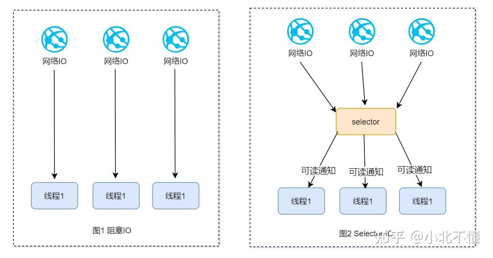
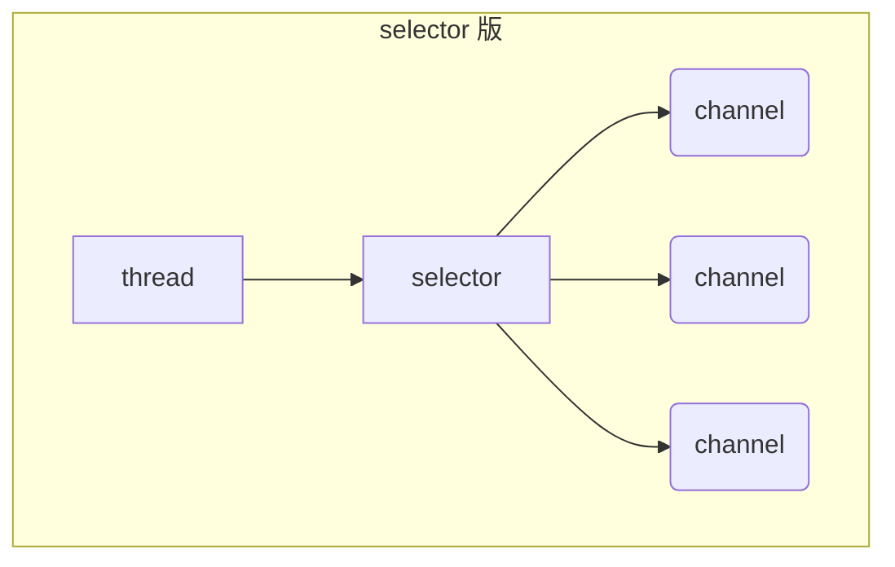

# 多线程 VS selector

以前大家都是用阻塞式IO来对网络IO进行数据请求，对于不同的IO都要分配一个线程来处理，如果没有数据就会进行等待，从而造成了阻塞，这种方式极大地浪费了资源（如图1）。

于是，有人就提出了一个想法，使用一个线程去监控多个IO请求，如果哪一个IO数据准备完毕后就通知相应的线程来处理，这就是selector模型（如图2）。而Java中的selector就是对selector模型的一种实现，用于询问选择已就绪的IO处理任务。

 

## selector 版设计

selector 的作用就是配合一个线程来管理多个 channel，获取这些 channel 上发生的事件，这些 channel 工作在非阻塞模式下，不会让线程吊死在一个 channel 上。适合连接数特别多，但流量低的场景（low traffic）

调用 selector 的 select() 会阻塞直到 channel 发生了读写就绪事件，这些事件发生，select 方法就会返回这些事件交给 thread 来处理

