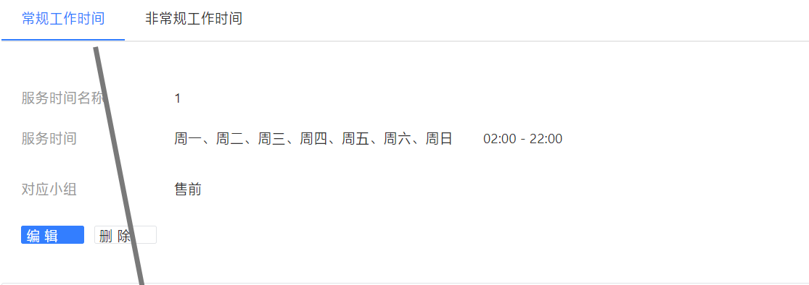
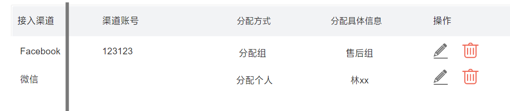

# 前提说明

访客/坐席端，im服务，呼叫中心服务之间交互的流程图时序图可以看本md所在目录的IM.drawio

访客端和坐席端会分别和im服务，呼叫中心服务建立websocket链接

和im服务连接是为了聊天用，而和呼叫中心链接是为了查询，保存信息等操作，原本可以使用http请求，但是不懂为啥要用websocket

# 登录成功发送导航栏消息

登录成功后 (1.websocket连接成功后；2.页面刷新也会重新连接；3.如果断开，在连接也算)

im服务会发送一个登录主题的mq（包含用户类型，用户id，公司，sessionId），呼叫中心接收到消息，进行判断

1. 当用户是访客就发送导航栏信息，请求im服务接口，通过im发送消息给访客

2. 当用户是坐席就更新坐席状态

>  非聊天记录的消息都通过websocket和前端传输，需要保留聊天记录的，就先发到im，im再通过websocket发到前端

# 超时自动结束会话

1. 访客点击 导航栏-转人工 的时候发送一个延时消息到mq，延时分钟从配置的超时分钟获取

2. 每次聊天，都会往redis设置这个会话的超时日期时间

3. 等收到延时消息，根据当前时间和redis上这个会话的超时日期时间对比，大于等于就结束会话，否则重新再发一条延时消息，等待下次超时判断

4.如果进入结束逻辑，坐席接待数就会减1

# 获取会话列表

获取服务中或者已结束的会话列表

刷新机制

1. 坐席且换空闲
2. 有人排队成功

2. 结束会话会触发

# 坐席状态切换

切成空闲时，触发以下事件

1. 坐席更新排队信息 -> 更新当前会话数，空闲时间
2. 分配新访客-如果有人在排队，则排进来

# 常用语

给坐席端用的，快捷发送

后台配置管理区新增通用的，也可以在坐席端新增自有的

# 渠道

渠道账号：各个平台的可以调用api来跟用户聊天的账号，比如微信公众号，whatsapp business账号等，并不是普通的用户账号（这种官方没提供聊天api）

客服：我们平台自己实现的客服，接收来自账号的消息，可以接收来自所有平台的消息

多个平台的消息->多平台账号 -> 我们的客服

接入国内外多个平台（微信公众，TG,INS啥的）的聊天接口，监听到客户发送的消息发到我们的新IM服务，我们通过对接的接口，收到消息后，调用转人工方法发给坐席，坐席收到后回复消息，在调用接入的接口给平台发消息。等于平台的消息中间转一层给到坐席，聊天用websocket实现

# 工作时间设置

用户转人工客服时会根据配置找有在工作时间内的

**常规工作时间**：指的是常规客服要上班的时间例如周一到周五

**非常规工作时间**：适用于节假日值班的时候，例如端午节、国庆节需要值班。

同一公司下同一客服组只能配置一次（非）常规工作时间，即公司-客服组-（非）常规类型 是唯一的

由于客服可以再多个小组内，怎么知道用哪个呢？

答：因为账号是属于某个渠道（平台），可以配置这个平台下的账号对应组，所以可以找到指定的组

