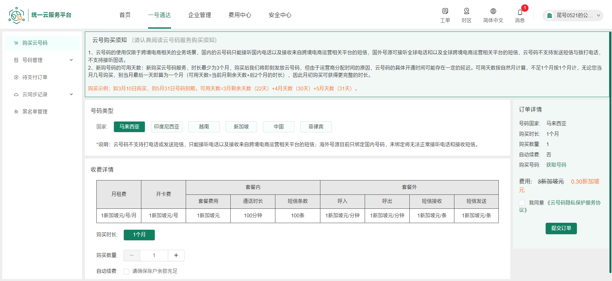
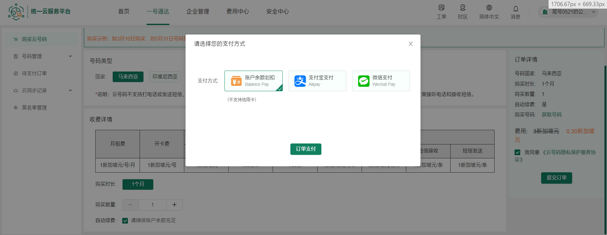
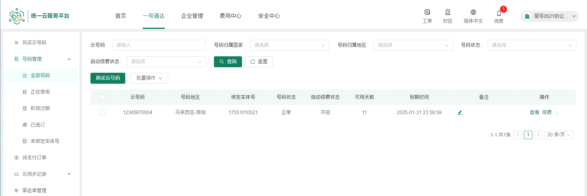
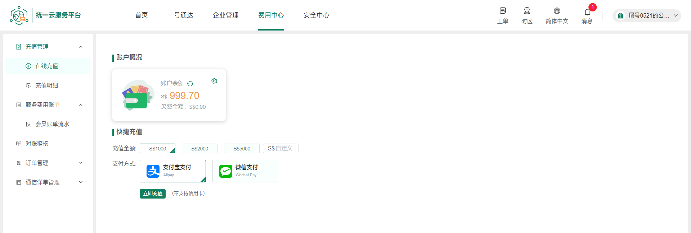
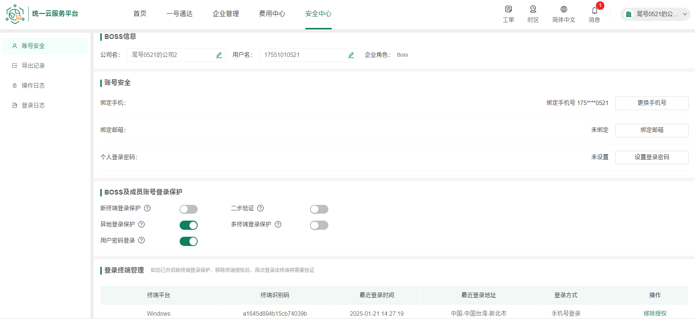
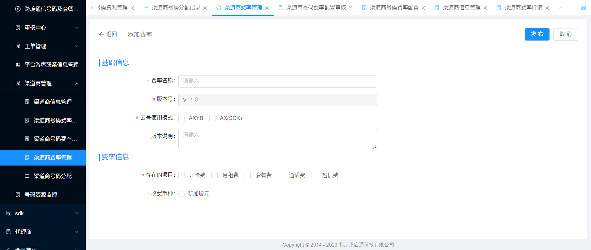
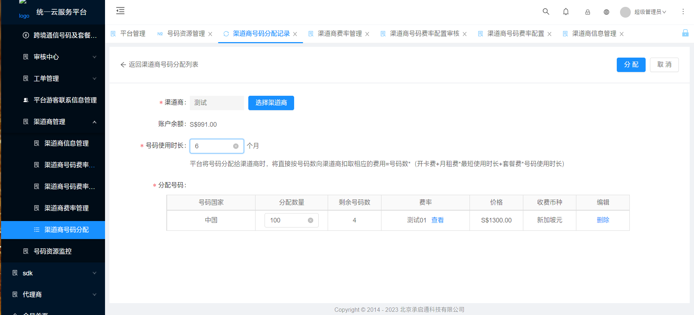

# 获取号码功能

域名只会访问主的，两个redis，所以永远只会访问主的redis，除非切换到备机房

## V1版本

从数据库根据号码排序获取，获取完了，就重头开始获取，获取的号码都放到redis，每次获取时都去除redis的号码

由于号码可能在不同国家相同，获取接口使用国家维度的锁，防止被不同用户重复获取

## v2版本

### 几个用到的redis key解释

**待售list**；类型:list；存储每个国家的号码

```
number:{country}
```

**锁定号码String**；类型:String；用户从待售list获取号码后，存下来10分钟；value是用户id（什么都行）

```
lock-get-number:{number}
```

**锁定号码hash**；类型:hash；用户从待售list获取号码后，存下来；用于获取后不购买，要恢复到**待售list**；**key**是**号码**，value是用户id，存用户id是为了获取后，过段时间再买校验是否属于这用户

```
lock-get-number-hash
```

### 几个方法解释

#### 获取号码

从**待售list**取下来，分别存到**锁定号码String**，**锁定号码hash**

#### 提交订单

1. 根据传过来号码列表，生成订单信息，订单里有存号码
2. 成功生成后，删除**锁定号码hash**里对应号码

#### 锁定号码hash 恢复到 待售list 定时任务

1. 获取所有**锁定号码String**，取出号码存到**list**
2. 获取所有**锁定号码hash**，取出号码存到**map**
3. 遍历**map**，找出在**map**，不在**list**的号码
4. **锁定号码hash**删除此号码
5. **待售list**添加此号码

### 会出现的疑问

#### 定时任务作用

1. 用户获取号码后不购买，但是已经从**待售list**删除了，过了10分钟后就要重新加回去
2. 比如获取成功，创建订单缺失败了，这时候**锁定号码hash**还没删除对应号码，就还可以恢复

#### 提交订单和定时任务同时执行，会出现并发问题吗

不会

1. 比如在创建订单成功后要删除**锁定号码hash**里A号码
2. 再删除前，线程突然切换到定时任务，去查找要恢复的号码
3. 这时候会查到A号码，但A号码还在**锁定号码String**，所以不会恢复到**待售list**

#### 极限情况

1. 获取完最还有零点几秒到期，这时候提交订单，
2. 到了第三步，线程不在提交订单线程，切换到了定时任务线程，
3. 此时可能过期了，定时任务把A号码恢复到**待售list**，
4. 同时其他用户获取到提交了订单，就会出现同时购买

**解决办法：**

定时任务获取恢复到**待售list**，延迟执行；

这样其他用户就不会获取到，比如延迟10秒，因为不可能切换到其他线程10秒，还没恢复到购买号码线程

#### 为什么不用set存储，然后pop随机获取呢

因为是双机房，pop没办法保证两个机房的redis随机获取的都是一样的，所以使用list，按顺序存放和获取

#### 其他问题

redis是单线程不用担心并发，如果获取的数量不满足用户要购买的数量，就放回redis

如果redis宕机了，就请求数据库查询待售的并把待支付订单的号码去掉，放回redis，这样就不会把售卖中的也给加回去，被重复购买

如果获取完了，就没办法像V1版本从头获取

## v3版本

### 简单讲

:存到redis的list，取的时候从list拿并存到延时队列，消费时判断是否需要恢复到list

### 细讲

**获取**

1. 从list获取号码
2. 存每个号码和用户id关系到`lock-get-number-hash`
3. 发送号码到恢复号码延迟队列，到期后判断是否需要恢复到list

### 购买

1. 获取后创建订单
2. 发送取消订单延迟消息，取消后恢复号码
3. 创建过程出现异常立即恢复号码

### 恢复号码延迟队列

1. 收到消息，拿到将要恢复号码，开始过滤
2. 去掉已存在redis的号码，防止重复加入
3. 过滤出还是待售的
4. 过滤出还在lock-get-number-hash里的号码（还在hash说明还没创建订单，可以恢复到待售list）
5. 过滤完成，恢复到redis

### 取消订单延迟队列

1. 去掉已存在redis的号码，防止重复加入
2. 过滤完成，恢复到redis


## 总结

V1版本获取号码使用了分布式锁，并发有问题，同一时间用户会获取不到号码，由于获取号码会锁定号码10分钟，但是等10分钟后别的用户也可以获取到，第一个用户获取后待在页面不动，10分钟后和第二个用户一起提交，就会重复购买，所以提交订单也加了国家锁，同一国家只能同时有一个用户购买，防止号码被两个用户获取到，然后一起提交订单重复购买

V2版本使用了redis防止并发问题，去锁化，这时候去提交订单也不会有问题，这个号码只被一个用户拥有

V3版本在V2版本基础上，从定时任务换成了延迟队列

# 获取自增编号

## v1

把编号存到表里，redis宕机重启后，从数据库里查找最大的那个+1恢复

如果刚开始为空，要先判断数据库有没有值，再去设置自增编号

问题就是并发会很慢

## v2

不使用自增，使用hutool的IdUtil.getSnowflakeNextIdStr()，没必要自增，只要是一直往上加的值就行

# 订单创建

先判断号码是否已出售且还被锁定住，判断前后端计算的金额是否一致，订单删除完成还要删除锁定的号码，不让号码重回待售list（定时任务在做重回list），返回订单ID

# 使用延时队列进行取消订单

取消待支付状态的订单，并恢复号码到redis的待售list

# 登录

有手机验证码，邮箱密码，手机号密码登录三种登录方式，点击登录后会返回不带公司id的token，然后出现选择公司的列表，选完后，在调用一个新接口填充公司id到token

# 支付完成，购买号码回调

记录用户和手机号的关系等处理


# 购买流程

## C端用户购买号码流程(支付不是我做的)

后台配置套餐，新增虚拟号码

请求创建订单接口`number-pkg/submitOrder`

1. 根据选择的国家，获取费率
2. 计算号码订单价格
3. 校验余额是否够
4. 获取号码
5. 创建订单
6. 返回订单id给前端
7. 前端弹出支付方式，如图2
8. 可选余额支付`pay/balnacePay`，或者第三方支付`pay/onlinePay`
9. 支付成功后，给买的虚拟号绑定实体号，此虚拟号可收到呼入和短信
10. 用户A拨打虚拟号X，X号码有绑定实体号，则分配一个Y号码给A，用Y去呼叫B+
11. 拨号完成，生成通话记录，推送给计费平台

余额支付具体流程

1. 发送half消息，有订单ID等数据，此时不能消费
2. 执行本地事务，更新订单详情，余额，流水
3. 成功后，可消费half消息，开始插入用户号码使用记录，号码生命周期，号码归属信息











## 管理后台分配给渠道商流程





1. 在运营级后台配置渠道商的费率

2. 选择要分配的渠道商，和号码时长数量，国家
3. 获取国家，费率计算订单金额
4. 获取号码
5. 创建订单
6. 使用余额支付

# AXYB 解释

**A**:拨号方

**X**:虚拟号

Y:虚拟号

**B**:实体号

虚拟号X绑定实体号B

当国外用户A呼叫云号码（X）时，先查询云号码（X）是否存在绑定关系，如果不存在，则呼叫失败；如果存在则查询X绑定的实体号（B），并且分配一个Y号码，去呼叫B。

# 项目我写的接口

登录接口

短信安全验证（企业认证，个人认证，号码转移(您)验证码，号码转移(对方)验证码，绑定实体号验证码，解绑实体号验证码，提交订单验证码，支付验证码，登录短信验证码，登录安全验证，重置密码验证，绑定邮箱短信验证，更换手机号-旧手机验证码，更换手机号-新手机号验证，个人实名认证短信验证，默认，提现记录申请）

创建，自动取消订单，订单支付完成回调处理

号码获取

分配号码（直接给企业用户购买号码，使用它们的余额购买）

