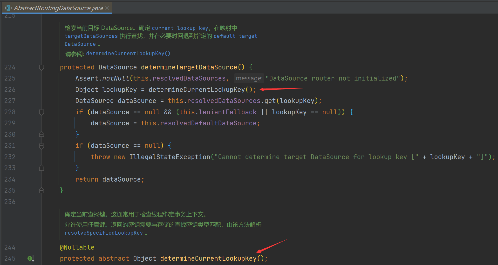
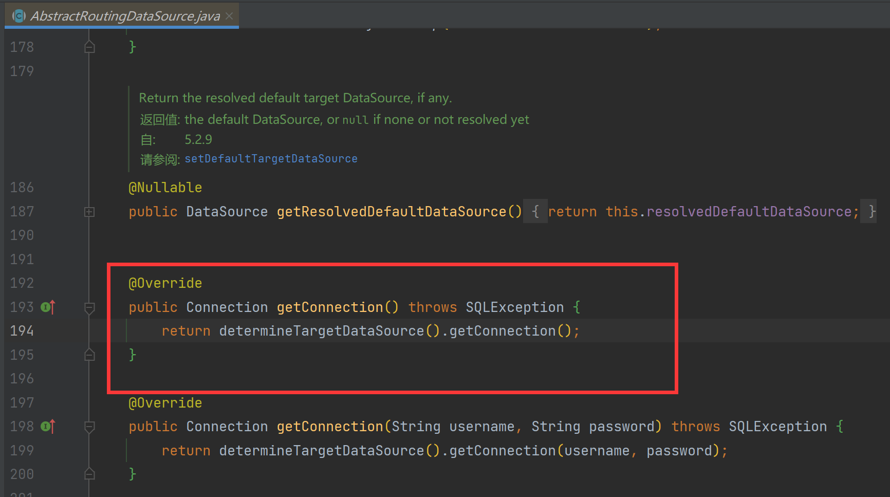
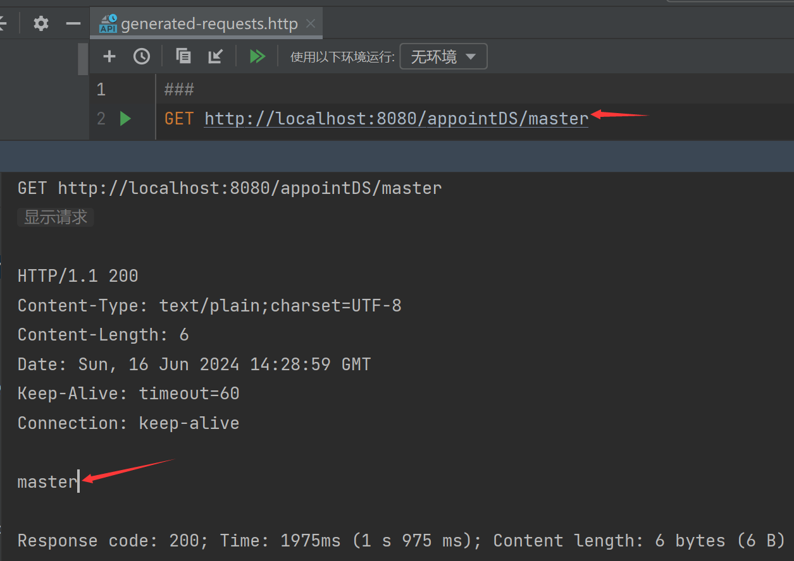
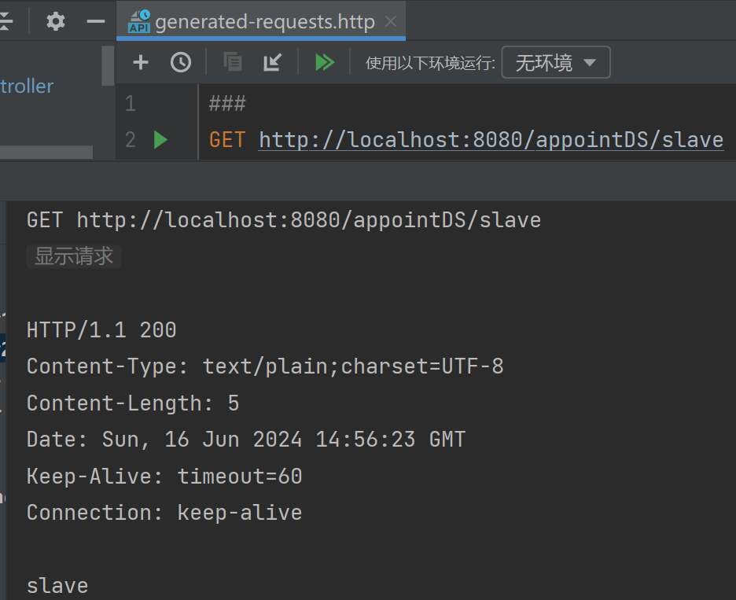
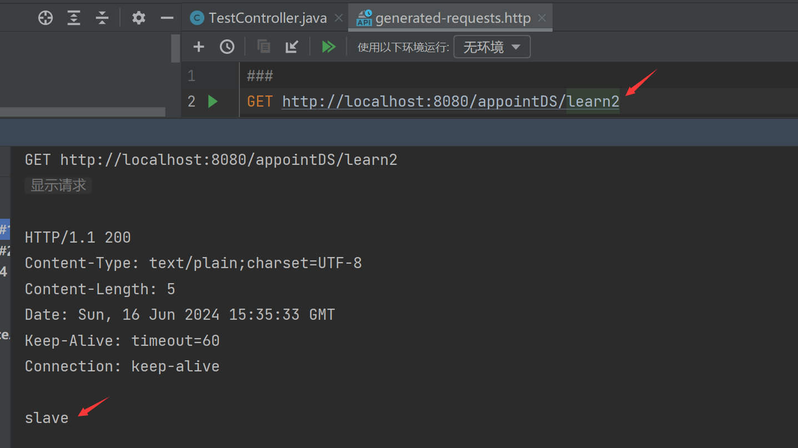
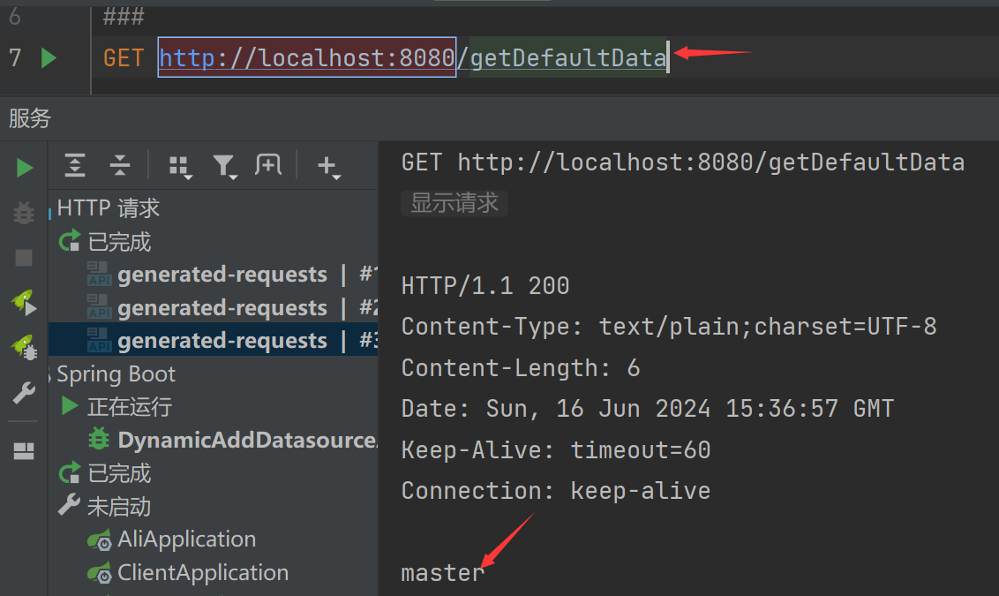
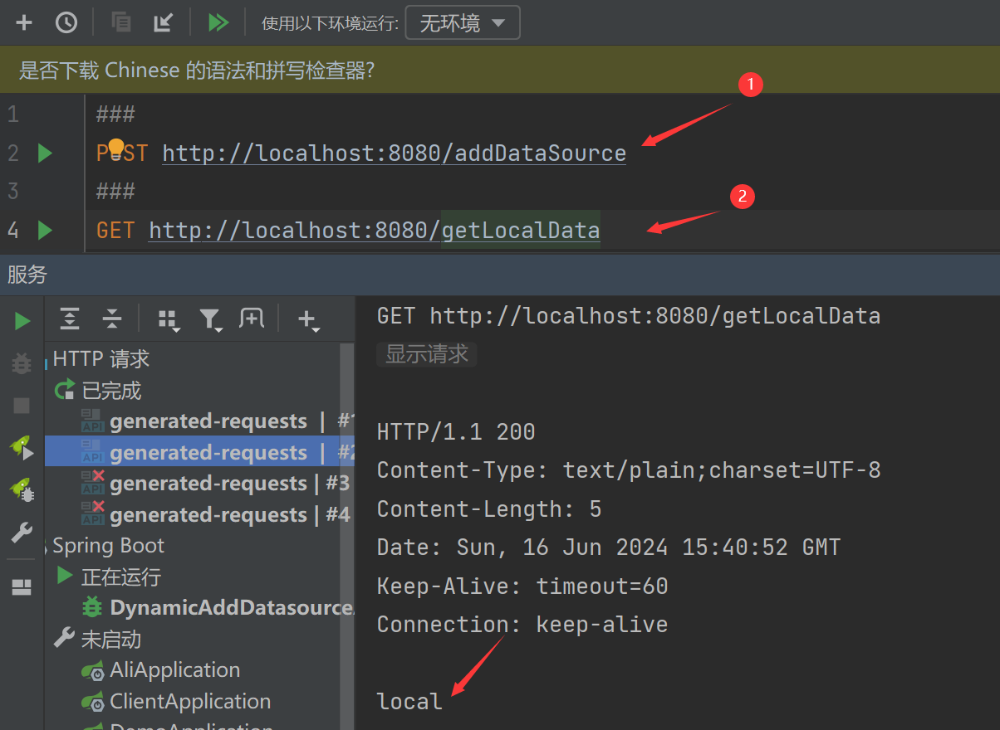

# 需求背景

1. 有默认的配置数据源
2. 但是其他的数据源需从数据库中获取加载
3. 并且可以实时添加数据源进行访问
4. 动态切换数据源

# 实现

使用 `ThreadLocal`,`AbstractRoutingDataSource`来实现数据源动态添加和切换

实现`AbstractRoutingDataSource`的`determineCurrentLookupKey`方法即可，获取存到`private Map<Object, DataSource> resolvedDataSources;`的数据源（key就是一般存数据库名称，value就是数据源；后面我们会设置进去），



当系统执行数据库操作之前，会先获取数据源链接，即调用 `getConnection` 方法，该类重写的 `getConnection` 方法，会获取到真正的目标数据源，就是调用上面的`determineCurrentLookupKey`方法，进而将数据库操作委托给目标数据源进行处理。



## 实现从配置文件读取多数据源

### 实现ThreadLocal

用于设置当前线程要使用的数据源设置，删除，查询

```java
public class DataSourceContextHolder {
    //此类提供线程局部变量。这些变量不同于它们的正常对应关系是每个线程访问一个线程(通过get、set方法),有自己的独立初始化变量的副本。
    private static final ThreadLocal<String> DATASOURCE_HOLDER = new ThreadLocal<>();

    /**
     * 设置数据源
     * @param dataSourceName 数据源名称
     */
    public static void setDataSource(String dataSourceName){
        DATASOURCE_HOLDER.set(dataSourceName);
    }

    /**
     * 获取当前线程的数据源
     * @return 数据源名称
     */
    public static String getDataSource(){
        return DATASOURCE_HOLDER.get();
    }

    /**
     * 删除当前数据源
     */
    public static void removeDataSource(){
        DATASOURCE_HOLDER.remove();
    }

}
```

### 实现AbstractRoutingDataSource

定义一个动态数据源类实现AbstractRoutingDataSource，通过determineCurrentLookupKey方法与上述实现的ThreadLocal类中的get方法进行关联，实现动态切换数据源。

```java
public class DynamicDataSource extends AbstractRoutingDataSource {

    /**
     * 构造方法，设置默认数据源和目标数据源集合
     *
     * @param defaultDataSource 默认数据源
     * @param targetDataSources 目标数据源集合，键是数据源标识，值是对应的数据源
     */
    public DynamicDataSource(DataSource defaultDataSource, Map<Object, Object> targetDataSources) {
        // 设置默认数据源
        super.setDefaultTargetDataSource(defaultDataSource);
        // 设置目标数据源集合
        super.setTargetDataSources(targetDataSources);
    }

    /**
     * 确定当前线程使用的数据源标识
     *
     * @return 当前线程使用的数据源标识
     */
    @Override
    protected Object determineCurrentLookupKey() {
        // 从线程上下文中获取当前数据源的标识
        return DataSourceContextHolder.getDataSource();
    }
}
```

### 配置数据源

application.yml，配置了两个主从库（假的主从，测试用无所谓）

```yaml
spring:
  datasource:
    type: com.alibaba.druid.pool.DruidDataSource
    druid:
      master:
        url: jdbc:mysql://ip:3306/learn?useUnicode=true&characterEncoding=UTF-8&serverTimezone=Asia/Shanghai
        username: root
        password: 123456
        driver-class-name: com.mysql.cj.jdbc.Driver
      slave:
        url: jdbc:mysql://ip:3306/learn2?useUnicode=true&characterEncoding=UTF-8&serverTimezone=Asia/Shanghai
        username: root
        password: 123456
        driver-class-name: com.mysql.cj.jdbc.Driver
```

创建 DynamicDataSource 对象，将 master 和 slave 数据源放入数据源集合中，返回一个动态数据源bean

```java
@Configuration
public class DateSourceConfig {

    /**
     * 配置master数据源
     *
     * @return master数据源
     */
    @Bean
    @ConfigurationProperties("spring.datasource.druid.master")
    public DataSource masterDataSource(){
        return DruidDataSourceBuilder.create().build();
    }

    /**
     * 配置slave数据源
     *
     * @return slave数据源
     */
    @Bean
    @ConfigurationProperties("spring.datasource.druid.slave")
    public DataSource slaveDataSource(){
        return DruidDataSourceBuilder.create().build();
    }

    /**
     * 创建动态数据源bean
     *
     * @return 动态数据源bean
     */
    @Bean(name = "dynamicDataSource")
    @Primary
    public DynamicDataSource createDynamicDataSource(){
        // 创建数据源集合
        Map<Object,Object> dataSourceMap = new HashMap<>();
        // 获取默认数据源
        DataSource defaultDataSource = masterDataSource();
        // 将数据源放入数据源集合中
        dataSourceMap.put("master",defaultDataSource);
        dataSourceMap.put("slave",slaveDataSource());
        // 返回动态数据源对象
        return new DynamicDataSource(defaultDataSource,dataSourceMap);
    }

}
```

### 创建表和数据

主库

```sql
CREATE TABLE `dynamic_datasource_user`
(
    `user_name` varchar(255) NOT NULL COMMENT '用户名'
);
INSERT INTO `dynamic_datasource_user`
VALUES ('master');

CREATE TABLE `dynamic_datasource_db_info`
(
    `id`                int          NOT NULL AUTO_INCREMENT COMMENT '主键Id',
    `url`               varchar(255) NOT NULL COMMENT '数据库URL',
    `username`          varchar(255) NOT NULL COMMENT '用户名',
    `password`          varchar(255) NOT NULL COMMENT '密码',
    `driver_class_name` varchar(255) NOT NULL COMMENT '数据库驱动',
    `name`              varchar(255) NOT NULL COMMENT '数据库名称',
    PRIMARY KEY (`id`) USING BTREE
);
INSERT INTO `dynamic_datasource_db_info`
VALUES (1, 'jdbc:mysql://ip:3306/learn2?useUnicode=true&Encoding=UTF-8&serverTimezone=Asia/Shanghai', 'root', '123456',
        'com.mysql.cj.jdbc.Driver', 'learn2');

```

从库

```sql
CREATE TABLE `dynamic_datasource_user`
(
    `user_name` varchar(255) NOT NULL COMMENT '用户名'
);
INSERT INTO dynamic_datasource_user (`user_name`)
VALUES ('slave');

```

### 控制器

根据请求路径中的 `datasourceName` 参数来动态指定当前线程使用的数据源。首先通过 `DataSourceContextHolder.setDataSource(datasourceName)` 设置当前线程使用的数据源，然后执行数据库操作，最后通过 `DataSourceContextHolder.removeDataSource()` 移除数据源设置。这样就能实现根据请求动态切换数据源进行数据库操作的功能。

```java
@RestController
@RequestMapping
public class TestController {

    @Resource
    private DynamicDatasourceUserService dynamicDatasourceUserService;

    @GetMapping("/appointDS/{datasourceName}")
    public String appointDS(@PathVariable("datasourceName") String datasourceName) {
        // 设置当前线程使用的数据源
        DataSourceContextHolder.setDataSource(datasourceName);
        // 执行数据库操作
        DynamicDatasourceUser user = dynamicDatasourceUserService.getOne();
        // 操作完成后移除数据源设置
        DataSourceContextHolder.removeDataSource();
        return user.getUserName();
    }

    /**
     * DataSourceContextHolder为空，默认master数据源，在DateSourceConfig#createDynamicDataSource()配置的
     */
    @GetMapping("/getDefaultData")
    public String getDefaultData() {
        return getUser();
    }

    private String getUser() {
        return dynamicDatasourceUserService.getOne().getUserName();
    }
}
```

### 测试

请求主库



请求从库



通过执行结果，我们看到传递不同的数据源名称，查询对应的数据库是不一样的，返回结果也不一样。

## 实现注解切换数据源

虽然已经实现了动态切换数据源，但是我们会发现如果涉及到多个业务进行切换数据源的话，我们就需要在每一个实现类中添加这一段代码(`DataSourceContextHolder.setDataSource(datasourceName);`)。

### 声明注解

```java
@Target({ElementType.METHOD,ElementType.TYPE})
@Retention(RetentionPolicy.RUNTIME)
@Documented
@Inherited
public @interface DS {
    String value() default "master";
}
```

### 切面

```java
@Aspect
@Component
@Slf4j
public class DSAspect {
    
    /**
     * 在带有 @DS 注解的方法周围织入切面逻辑
     */
    @Around("@annotation(com.yhy.DSAspect.DS)")
    public Object datasourceAround(ProceedingJoinPoint point) throws Throwable {
        // 获取被调用方法的签名信息
        MethodSignature signature = (MethodSignature) point.getSignature();
        Method method = signature.getMethod();
        // 获取方法上的 @DS 注解
        DS ds = method.getAnnotation(DS.class);
        if (Objects.nonNull(ds)) {
            // 根据注解的值设置数据源
            DataSourceContextHolder.setDataSource(ds.value());
        }
        try {
            // 执行被调用的方法
            return point.proceed();
        } finally {
            // 方法执行完毕后移除数据源设置
            DataSourceContextHolder.removeDataSource();
        }
    }
}
```

### 控制器

```java
@RestController
@RequestMapping
public class TestController {

    @Resource
    private DynamicDatasourceUserService dynamicDatasourceUserService;

    /**
     * 注解没填指，默认master数据源
     */
    @GetMapping("/getMasterDataForDSAspect")
    @DS
    public String getMasterDataForDSAspect() {
        return getUser();
    }

    @GetMapping("/getSlaveDataForDSAspect")
    @DS("slave")
    public String getSlaveDataForDSAspect() {
        return getUser();
    }

    private String getUser() {
        return dynamicDatasourceUserService.getOne().getUserName();
    }
}
```

### 测试

结果肯定正确，就不贴上来

## 实现 从数据库读取数据源 并且可以 实时添加数据源

### 数据源实体

```java
@Data
@TableName(value = "dynamic_datasource_db_info")
public class DynamicDatasourceDbInfo {
    /**
     * 数据库地址
     */
    @TableId(value = "id", type = IdType.INPUT)
    private Integer id;
    /**
     * 数据库连接地址
     */
    @TableField(value = "url")
    private String url;
    /**
     * 数据库用户名
     */
    @TableField(value = "username")
    private String username;
    /**
     * 密码
     */
    @TableField(value = "password")
    private String password;
    /**
     * 数据库驱动
     */
    @TableField(value = "driver_class_name")
    private String driverClassName;

    /**
     * 数据库名，即保存Map中的key
     */
    @TableField(value = "name")
    private String name;
}
```

### 重新实现AbstractRoutingDataSource

主要新增三个方法用于初始化和实时新增

**initDataSource**：初始化数据源

**addNewDataSource**：新增新数据源

**updateDataSource**：更新数据源（让数据源立即生效可用）

```java
/**
 * 实现动态数据源，根据AbstractRoutingDataSource路由到不同数据源中
 **/
@Slf4j
public class DynamicDataSource extends AbstractRoutingDataSource {

    /**
     * 用于项目初始化，存储从数据库读取的数据源
     */
    private final Map<Object, Object> targetDataSourceMap;

    public DynamicDataSource(DataSource defaultDataSource, Map<Object, Object> targetDataSources) {
        super.setDefaultTargetDataSource(defaultDataSource);
        super.setTargetDataSources(targetDataSources);
        this.targetDataSourceMap = targetDataSources;
    }

    @Override
    protected Object determineCurrentLookupKey() {
        return DataSourceContextHolder.getDataSource();
    }

    /**
     * 从数据库中获取连接信息，初始化数据源
     *
     * @param dbInfoList 数据源实体集合
     */
    public void initDataSource(List<DynamicDatasourceDbInfo> dbInfoList) {
        try {
            if (CollectionUtils.isNotEmpty(dbInfoList)) {
                for (DynamicDatasourceDbInfo dbInfo : dbInfoList) {
                    //校验数据库是否可以连接
                    Class.forName(dbInfo.getDriverClassName());
                    DruidDataSource dataSource = createDataSourceConnection(dbInfo);
                    targetDataSourceMap.put(dbInfo.getName(), dataSource);
                    log.info("------添加数据源-----：" + dbInfo.getName() + ":成功");
                }
            }
            updateDataSource(targetDataSourceMap);
        } catch (Exception e) {
            log.error("添加数据源信息异常", e);
        }
    }

    /**
     * 根据传递的数据源信息测试数据库连接
     */
    public DruidDataSource createDataSourceConnection(DynamicDatasourceDbInfo dbInfo) throws Exception {
        //定义数据库
        DruidDataSource dataSource = new DruidDataSource();
        BeanUtils.copyProperties(dbInfo, dataSource);
        //申请连接时执行validationQuery检测连接是否有效，这里建议配置为TRUE，防止取到的连接不可用
        dataSource.setTestOnBorrow(true);
        //建议配置为true，不影响性能，并且保证安全性。
        //申请连接的时候检测，如果空闲时间大于timeBetweenEvictionRunsMillis，执行validationQuery检测连接是否有效。
        dataSource.setTestWhileIdle(true);
        //用来检测连接是否有效的sql，要求是一个查询语句。
        dataSource.setValidationQuery("select 1 ");
        dataSource.init();
        return dataSource;
    }

    /**
     * 新增数据源
     * 需要实时新增的数据源调这个方法
     */
    public void addNewDataSource(DynamicDatasourceDbInfo dbInfo) throws Exception {
        Map<Object, DataSource> resolvedDataSources = getResolvedDataSources();
        Map<Object, Object> targetDataSources = resolvedDataSources.entrySet().stream().collect(Collectors.toMap(Map.Entry::getKey, Map.Entry::getValue));
        Class.forName(dbInfo.getDriverClassName());
        DruidDataSource dataSource = createDataSourceConnection(dbInfo);
        targetDataSources.put(dbInfo.getName(), dataSource);
        updateDataSource(targetDataSources);
    }

    /**
     * 更新数据源
     * 真正把数据源交给spring容器管理
     */
    private void updateDataSource(Map<Object, Object> targetDataSources) {
        setTargetDataSources(targetDataSources);
        // 将TargetDataSources中的连接信息放入resolvedDataSources管理
        //在设置完目标数据源和默认数据源后，需要调用这个方法来确保AbstractRoutingDataSource的正确初始化。
        afterPropertiesSet();
    }
}
```

### 项目初始化数据源

```java
/**
 * 项目启动，从数据库中初始化数据源
 */
@Component
public class LoadDataSourceRunner implements CommandLineRunner {
    @Resource
    private DynamicDataSource dynamicDataSource;
    @Resource
    private DynamicDatasourceDbInfoMapper dynamicDatasourceDbInfoMapper;

    @Override
    public void run(String... args) {
        List<DynamicDatasourceDbInfo> dbInfoList = dynamicDatasourceDbInfoMapper.list();
        if (CollectionUtils.isNotEmpty(dbInfoList)) {
            dynamicDataSource.initDataSource(dbInfoList);
        }
    }
}
```

### 数据源配置

application.yml

```yaml
spring:
  datasource:
    type: com.alibaba.druid.pool.DruidDataSource
    druid:
      master:
        url: jdbc:mysql://47.116.44.79:3306/learn?useUnicode=true&characterEncoding=UTF-8&serverTimezone=Asia/Shanghai
        username: root
        password: 123456
        driver-class-name: com.mysql.cj.jdbc.Driver
```

### 加载数据源

只加主库，从库从表面读取，以此来验证从数据库读取数据

```java
@Configuration
public class DateSourceConfig {

    @Bean
    @ConfigurationProperties("spring.datasource.druid.master")
    public DataSource masterDataSource() {
        return DruidDataSourceBuilder.create().build();
    }

    @Bean(name = "dynamicDataSource")
    @Primary
    public DynamicDataSource createDynamicDataSource() {
        Map<Object, Object> dataSourceMap = new HashMap<>();
        DataSource defaultDataSource = masterDataSource();
        dataSourceMap.put("master", defaultDataSource);
        return new DynamicDataSource(defaultDataSource, dataSourceMap);
    }

}
```

### 控制器-实时新增数据源测试

```java
@RestController
@RequestMapping
public class TestController {

    @Resource
    private DynamicDatasourceUserService dynamicDatasourceUserService;
    @Resource
    private DynamicDataSource dynamicDataSource;
    @GetMapping("/appointDS/{datasourceName}")
    public String appointDS(@PathVariable("datasourceName") String datasourceName) {
        DataSourceContextHolder.setDataSource(datasourceName);
        DynamicDatasourceUser user = dynamicDatasourceUserService.getOne();
        DataSourceContextHolder.removeDataSource();
        return user.getUserName();
    }

    /**
     * DataSourceContextHolder为空，默认master数据源，在DateSourceConfig#createDynamicDataSource()配置的
     */
    @GetMapping("/getDefaultData")
    public String getDefaultData() {
        return getUser();
    }

    @PostMapping("/addDataSource")
    public void addDataSource() throws Exception {
        DynamicDatasourceDbInfo dbInfo=new DynamicDatasourceDbInfo();
        dbInfo.setId(1);
        dbInfo.setUrl("jdbc:mysql://127.0.0.1:3306/learn?useUnicode=true&characterEncoding=UTF-8&serverTimezone=Asia/Shanghai");
        dbInfo.setUsername("root");
        dbInfo.setPassword("123456");
        dbInfo.setDriverClassName("com.mysql.cj.jdbc.Driver");
        dbInfo.setName("local");
        dynamicDataSource.addNewDataSource(dbInfo);
    }
    
    @GetMapping("/getLocalData")
    public String getLocalData() {
        DataSourceContextHolder.setDataSource("local");
        String user = getUser();
        DataSourceContextHolder.removeDataSource();
        return user;
    }

    private String getUser() {
        return dynamicDatasourceUserService.getOne().getUserName();
    }
}
```

### 测试

#### 指定数据源

存的key是表里面的name字段值 -> learn2，返回这个从库的值是对了



#### 默认数据源

验证默认数据源配置的是master，createDynamicDataSource()里面配的



#### 实时新增数据源

先请求新增接口，在请求查询接口，发现确实可以

