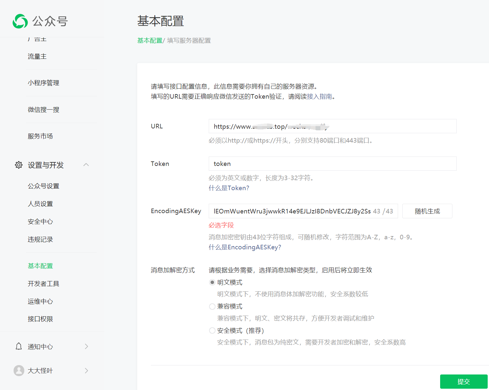

# 配置服务器配置

## 填写配置

1. 进入公众号页面-基本配置
2. 填写自己的服务器验证接口
3. 填写一个token（随便填），接口验证也用这个值
4. 消息加密秘钥随机生成
5. 解密选明文模式



## 验证接口开发

https://developers.weixin.qq.com/doc/offiaccount/Basic_Information/Access_Overview.html，先看文档跟着文档写个验证接口

这里的token值跟配置页面填写的token是一样的，然后对比下微信传过来的参数加密进行对比看看正不正确即可；此服务是8080端口

```java
@RestController
@RequestMapping("/wechat")
@Slf4j
public class WechatController {

    @GetMapping("/verify")
    public String verify(String signature, String timestamp, String nonce, String echostr, HttpServletRequest request) {
        log.info("signature: {},  timestamp: {}, nonce: {}, echostr: {}", signature, timestamp, nonce, echostr);
        String token = "token";
        String[] params = {token, timestamp, nonce};
        Arrays.sort(params);
        String sortedParams = String.join("", params);
        log.info("sortedParams:{}", sortedParams);
        String sha1 = SecureUtil.sha1(sortedParams);
        log.info("sha1:{}", sha1);
        if (StrUtil.equalsAnyIgnoreCase(sha1, signature)) {
            return echostr;
        }
        return "FAIL";
    }
}
```


## nginx转发配置

我的服务器申请了证书，都使用https请求接口，所以监听https的时候，

配置了一个代理规则，将任意请求转发到指定的后端服务器（服务器IP:8080）

这样填写服务器验证接口地址时https://www.域名.top/wechat/verify，就会转发到接口所属的服务器ip使用http请求

```
user  nobody;
worker_processes  1;

events {
    worker_connections  1024;
}

http {
    include       mime.types;
    default_type  application/octet-stream;

    sendfile        on;
    keepalive_timeout  65;

    server {
        listen       443 ssl;
        server_name  www.域名.top;

        ssl_certificate      /usr/local/nginx/conf/cert/www.域名.top.pem;
        ssl_certificate_key  /usr/local/nginx/conf/cert/www.域名.top.key;

        ssl_session_cache    shared:SSL:1m;
        ssl_session_timeout  5m;

        ssl_ciphers  HIGH:!aNULL:!MD5;
        ssl_prefer_server_ciphers  on;

        location / {
            proxy_pass http://服务器ip:8080;
        }
    }
}

```


