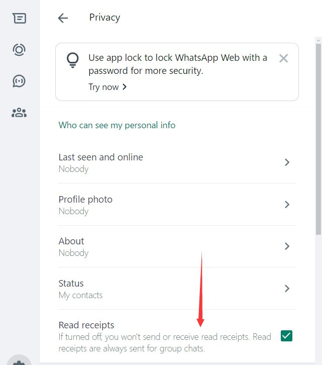

# 官方文档地址

https://developers.facebook.com/docs/whatsapp/cloud-api/overview/?translation

# 官方postman接口地址

请求返回内容都有，比如发消息，接收webhook事件（收消息）：https://www.postman.com/meta/workspace/whatsapp-business-platform/request/13382743-1b657873-9991-436e-91f2-b6583314acef

# 获取 临时/永久 口令 第三方视频教程

全局翻墙打开：https://www.yijia-soft.com/CloudAPI.html

# 获取口令官方文档

https://developers.facebook.com/blog/post/2022/12/05/auth-tokens/?locale=zh_CN

1. 使用云端api，本地api需要部署且弃用了
2. token在创建应用的时候会生成，有临时24小时的，也有永久的，测试的时候用临时的
3. sdk可以网上看看，有的JDK8不能用，要升级

# webhook

一种用来实时接收和处理平台上发生的事件的机制。通过Webhook，服务器能够监听并自动响应来自平台的特定事件，如接收到的消息、状态更新等。

配置webhook地址文档：https://developers.facebook.com/docs/graph-api/webhooks/getting-started#create-endpoint

配置了这个地址后，以后比如收到用户消息，就会发给这个地址

但是配置这个地址前会验证这个地址是否是你的保证安全

1. 验证使用get请求，返回官方发给你的challenge参数即可
2. 收事件使用post，json接收参数

Webhooks 通知参数文档：https://developers.facebook.com/docs/whatsapp/cloud-api/webhooks/components#messages-object

收到的消息文档都有写，拿到后做你需要的事情即可

# 发送消息限制

## 会话有效期

开头有写会话有效期24小时：https://developers.facebook.com/docs/whatsapp/message-templates/guidelines#template-pacing 

想要发送消息，用户得主动发过来，我们才能发送过去，不然用户也收不到

## 媒体类型

上传下载媒体文件，媒体类型文档：https://developers.facebook.com/docs/whatsapp/cloud-api/reference/media/#download-media

发送媒体消息请求需要上传到它们的服务器才能发


# 模板

## 模板消息文档

https://developers.facebook.com/docs/whatsapp/business-management-api/message-templates/?translation

## 更新模板通知和组件说明

更改了标题或正文，或添加了一个按钮的通知

https://developers.facebook.com/docs/whatsapp/business-management-api/message-templates/components/?translation

## 消息模板状态更新通知示例

#### 模板获批，模板被拒等

https://developers.facebook.com/docs/whatsapp/business-management-api/webhooks/components#message-template-updates

## 模板类别

有三种：营销模板，交易相关模板，身份验证模板

更改模板类别结果，会通过webhook通知

https://developers.facebook.com/docs/whatsapp/updates-to-pricing/new-template-guidelines

## 根据消息模板 ID 进行 增删改查

可以查询被拒原因，更新

https://developers.facebook.com/docs/graph-api/reference/v19.0/whats-app-business-hsm

## 发送模板消息

https://developers.facebook.com/docs/whatsapp/cloud-api/guides/send-message-templates

# 消息已读功能

https://developers.facebook.com/docs/whatsapp/conversation-types

> 用户已读取您公司发送的消息。 `read `通知仅适用于启用了已读回执的用户。如果用户未启用已读回执，则您只会收到 `delivered `通知。

官方明确指出要用户自己开启回执才行，进入隐私手动开启



```JSON
{
    "object": "whatsapp_business_account",
    "entry": [
        {
            "id": "203211149534439",
            "changes": [
                {
                    "value": {
                        "messaging_product": "whatsapp",
                        "metadata": {
                            "display_phone_number": "6580849967",
                            "phone_number_id": "408767922318931"
                        },
                        "statuses": [
                            {
                                "id": "wamid.HBgNODYxOTk4MzcyNTMzNxUCABEYEkUxNUE0NUFFQzRDMzE4NTkyRAA=",
                                "status": "read",
                                "timestamp": "1732071723",
                                "recipient_id": "8619983725337"
                            }
                        ]
                    },
                    "field": "messages"
                }
            ]
        }
    ]
}
```

这时候就会收到已读的通知`"status": "read"`