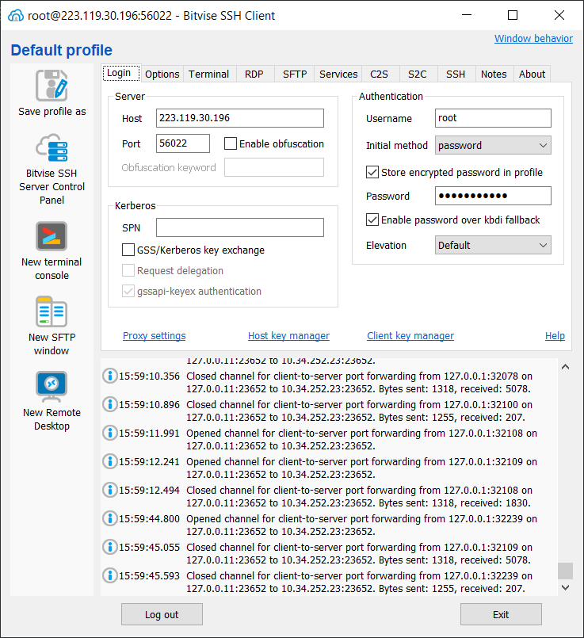
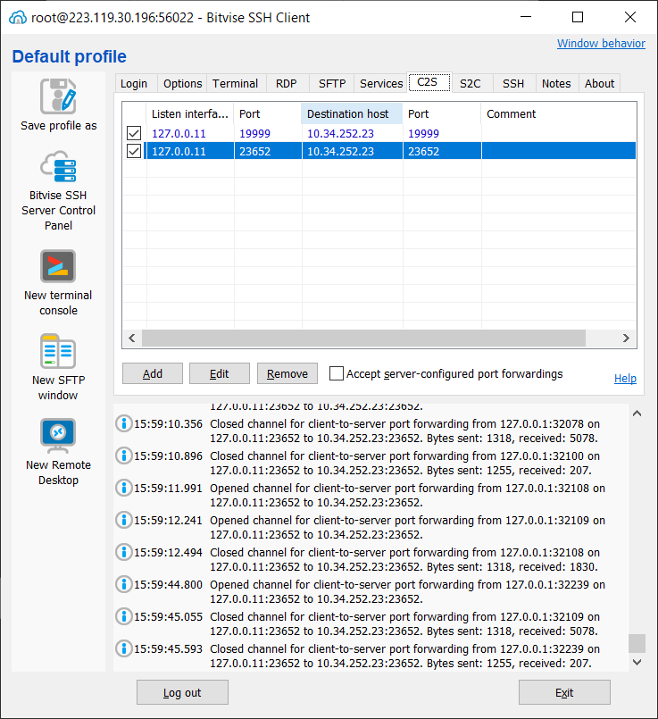

# 下载安装 https://bitvise.com/ssh-client-download 

# 输入跳板机信息

# 配置要链接的主机和端口

**CS2** 是指 **"Command Shell 2"**，是该软件的一种增强的命令行界面（Command Shell）功能，旨在提供更强大的远程管理和交互体验。

# 测试

访问 http://127.0.0.11:23652/preview，就会请求kkFileView预览页面